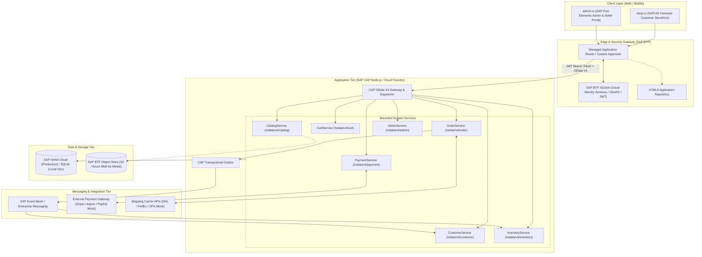
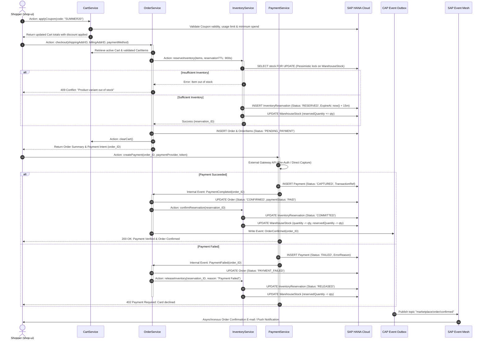

# Architecture Blueprint: Enterprise E-Commerce Marketplace
**Platform:** SAP Cloud Application Programming Model (CAP Node.js) & SAP BTP  
**Version:** 1.0.0 (Production Specification)  
**Author:** Lead SAP Solution Architect & Principal Full-Stack Engineer  

---

## 1. Executive Summary & Vision

The objective of this architecture is to design a high-throughput, cloud-native, multi-vendor e-commerce marketplace platform engineered for resilience, transactional consistency, and enterprise operability. Inspired by Amazon's multi-sided marketplace model (Buyers, 3rd-Party Sellers, Operations/Fulfillment), the system delivers:

- **Customer Storefront (`shop-ui`):** A custom, highly responsive **SAPUI5 Freestyle** customer portal providing sub-second browsing, dynamic faceted search, variant matrix resolution, seller offer comparison ("Buy Box"), cart management, and streamlined checkout.
- **Backoffice & Seller Hub (`admin-ui`):** An **SAP Fiori Elements (OData V4)** suite enabling multi-vendor catalog ingestion, inventory replenishment, warehouse fulfillment, customer order lifecycle handling, and financial dispute moderation.
- **Modular Core Engine:** Powered by **SAP CAP (Node.js)** implementing domain-driven design (DDD) micro-services exposing **OData V4** APIs.
- **Enterprise Persistence:** Dual-mode persistence leveraging **SQLite** for rapid local continuous testing and **SAP HANA Cloud (HDI Container)** with in-memory calculation, column store, and transactional locking for cloud deployment.
- **BTP Cloud Foundry Runtime:** Containerized deployment packaged as a **Multitarget Application (MTA)** utilizing SAP BTP Managed Approuter, XSUAA for OAuth2/OIDC RBAC, and SAP Event Mesh for decoupled asynchronous transactions.

---

## 2. Architectural Principles

1. **Domain-Driven Modular Monolith:** Services are organized strictly around business bounded contexts (Catalog, Customer, Cart, Order, Payment, Inventory, Administration). While deployed initially as a cohesive scalable Node.js runtime on Cloud Foundry, each service is architecturally isolated to permit zero-downtime decomposition into standalone microservices if domain scaling demands it.
2. **Stateless Business Logic & Optimistic Concurrency:** All HTTP/OData endpoints are strictly stateless. Concurrency control over high-contention assets (such as stock counts and pricing offers) uses CAP managed `@odata.etag` and transactional short-lived locking mechanisms.
3. **Two-Phase Inventory Commitment:** In an enterprise marketplace, inventory reservation must occur at order checkout initiation with a Time-To-Live (TTL), guaranteeing that customers do not complete payments for out-of-stock items, while preventing permanent deadlocks if payment fails.
4. **Decoupled Asynchronous Processing:** Side effects (e-mail/SMS notifications, seller metrics updates, analytical aggregations, payment webhook captures) execute asynchronously via CAP Eventing backed by SAP Event Mesh / Redis, leaving critical user paths fast.
5. **Zero-Trust Identity & Row-Level Multi-Tenancy:** Multi-vendor isolation ensures that Sellers can only access, update, and fulfill orders and inventory belonging strictly to their assigned Seller ID, enforced directly at the CDS persistence projection layer (`@restrict`).

---

## 3. High-Level System Architecture

The following diagram illustrates the complete end-to-end architecture across Client, Gateway, Application, Eventing, and Persistence layers.

---

## 4. Component Breakdown

### 4.1. Presentation Layer
- **`shop-ui` (Customer Storefront):**
  - Built with **SAPUI5 Freestyle (v1.120+)** to achieve the branding flexibility, sub-second client interactions, dynamic carousels, responsive grid layouts, and custom micro-interactions expected of consumer e-commerce platforms.
  - Implements an Amazon-style multi-tier hierarchy: Header Mega-Search, Category Taxonomy Navigation, Faceted Filter Panels, Product Detail Page (PDP) with real-time stock quotes and seller "Buy Box" comparisons, Sticky Quick-Cart Drawer, and an accessible Multi-Step Checkout Wizard.
  - Communicates via strict **OData V4 Two-Way Data Binding** using batch group operations (`$auto`) and explicit submit triggers (`$direct`).
- **`admin-ui` (Backoffice, Operations & Seller Hub):**
  - Built with **SAP Fiori Elements for OData V4** utilizing standard enterprise floorplans: List Report, Object Page, Analytical Overview Page (OVP), and Flexible Column Layout (FCL).
  - Maximizes developer efficiency and governance by driving UI layout, facet hierarchies, table columns, filter bars, and contextual actions entirely through CDS UI Annotations (`@UI.*`, `@Common.*`).
  - Implements native **CAP Draft Orchestration (`@odata.draft.enabled`)** for multi-step catalog onboarding, warehouse transfers, and order adjustments with built-in concurrency protection.

### 4.2. Edge, Gateway & Security Layer
- **SAP BTP Managed Application Router:** Acts as the Single Point of Entry (SPOE) reverse proxy, serving static UI artifacts from the HTML5 Application Repository, validating session cookies, orchestrating CSRF token handshakes, and routing REST/OData requests to the CAP backend.
- **SAP BTP XSUAA Service:** Handles enterprise authentication using OAuth 2.0 / OpenID Connect (OIDC). Evaluates JWT tokens issued to clients, providing role-based security scopes to the CAP runtime.

### 4.3. Business Logic & Application Layer (SAP CAP Node.js)
The core backend is implemented using `@sap/cds` on Node.js (Active LTS). It manages seven business domain services:
1. **CatalogService:** High-speed, public/authenticated product discovery, hierarchical categories, search indexing, product reviews, and active seller offers.
2. **CustomerService:** Customer profile maintenance, address book (shipping/billing), saved payment tokens, notification subscriptions, and wishlist management.
3. **CartService:** High-concurrency cart persistence, coupon discount evaluation, real-time subtotal/tax/shipping estimation, and abandoned cart tracking.
4. **OrderService:** State-machine-driven order processing (Created $\rightarrow$ Confirmed $\rightarrow$ Processing $\rightarrow$ Shipped $\rightarrow$ Delivered $\rightarrow$ Returned/Cancelled), transactional order placement, and return/refund orchestration.
5. **PaymentService:** Integration with external mock payment gateways, tokenization, pre-authorization, capture on fulfillment, and refund handling.
6. **InventoryService:** Multi-warehouse stock tracking, 2-phase reservation engine (`reserveInventory` with TTL, `confirmReservation`, `releaseInventory`), backorder prevention, and replenishment triggers.
7. **AdminService:** Consolidated backoffice service with granular RBAC for Sellers, Product Managers, Order Managers, Inventory Managers, and Platform Administrators.

### 4.4. Persistence & Data Tier
- **Local Development:** SQLite (file or in-memory) managed automatically via `cds watch` for instantaneous feedback loops and deterministic unit/integration testing.
- **Production:** SAP HANA Cloud via SAP HDI (HANA Deployment Infrastructure) container. Employs:
  - In-memory columnar storage with secondary indexes on high-cardinality foreign keys (`product_ID`, `seller_ID`, `order_ID`).
  - Full-Text Search (FTS) indexes on product title, description, and keywords.
  - Native temporal audit logging for compliance and order status tracking.
- **Media Assets:** Product images, seller identity documents, and digital invoices reside in an S3-compatible SAP BTP Object Store, with metadata and signed URIs maintained in SAP HANA.

---

## 5. End-to-End Transactional Flow: Checkout & Fulfillment

The following sequence diagram demonstrates the transactional mechanics and cross-service orchestration executing a resilient, real-world purchase.

---

## 6. High Availability, Scalability & Resilience Strategy

| Dimension | Architectural Strategy | Production Implementation |
| :--- | :--- | :--- |
| **Horizontal Scalability** | Stateless application tier | Cloud Foundry Application Autoscaler scaling CAP Node.js instances dynamically based on CPU (>70%) and concurrent HTTP request queue depth. |
| **Database Scalability** | In-Memory & Read Replication | SAP HANA Cloud multi-node elasticity with dedicated read replicas for Catalog and Reporting queries; primary node handles ACID write transactions. |
| **Resilience & Circuit Breaking** | Fail-safe external service integration | OData outbound calls and external payment/shipping gateways wrapped using Bosh / `@sap-cloud-sdk/resilience` circuit breakers and retry policies with exponential backoff. |
| **Transactional Outbox** | Guaranteed At-Least-Once Delivery | CAP Transactional Outbox pattern guarantees that domain events (e.g., `OrderPlaced`, `InventoryDeducted`) are written to the database in the exact same database transaction as the business entity, eliminating dual-write anomalies. |
| **Observability & APM** | Distributed Tracing & Metrics | OpenTelemetry instrumentation feeding SAP Cloud Logging service and Dynatrace; structured correlation IDs (`x-correlation-id`) propagated through Approuter $\rightarrow$ CAP $\rightarrow$ HANA. |
| **Cache Strategy** | Edge & Memory Optimization | In-memory HTTP cache headers for static catalog metadata; Redis cache layer for active session carts and trending category taxonomies. |
