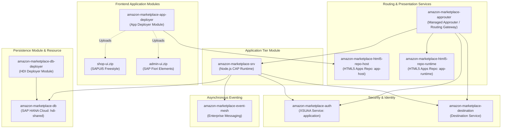
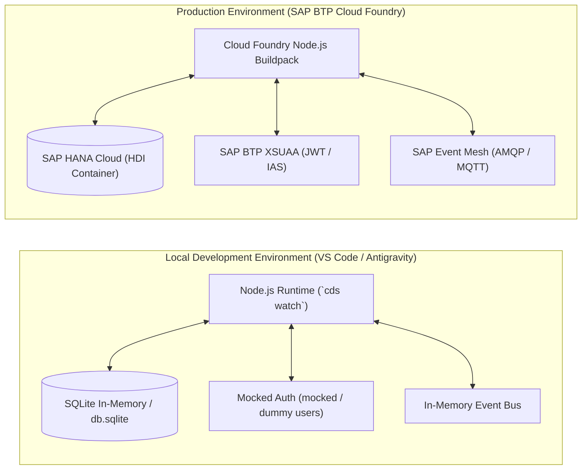
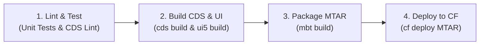

# Deployment & Multitarget Application (MTA) Architecture
**Platform:** SAP BTP Cloud Foundry & SAP HANA Cloud  
**Packaging:** Multitarget Application (MTA / MTAR)  
**Version:** 1.0.0 (Production Specification)  

---

## 1. Multitarget Application (MTA) Topology

In SAP BTP, the application is packaged as a unified **Multitarget Application (MTA)** adhering to declarative dependency management. The system orchestrates database artifact deployment, backend microservice containers, HTML5 application bundle distribution, and edge routing.



---

## 2. Complete MTA Specification (`mta.yaml`)

Below is the production-grade `mta.yaml` deployment descriptor:

```yaml
_schema-version: '3.1'
ID: amazon-marketplace
description: Enterprise E-Commerce Multi-Vendor Marketplace Application
version: 1.0.0

modules:
  # ------------------------------------------------------------
  # 1. CAP NODE.JS BACKEND SERVICE
  # ------------------------------------------------------------
  - name: amazon-marketplace-srv
    type: nodejs
    path: gen/srv
    requires:
      - name: amazon-marketplace-db
      - name: amazon-marketplace-auth
      - name: amazon-marketplace-destination
      - name: amazon-marketplace-event-mesh
    provides:
      - name: srv-api
        properties:
          srv-url: ${default-url}
    parameters:
      buildpack: nodejs_buildpack
      memory: 1024M
      disk-quota: 1024M
    build-parameters:
      builder: npm-ci

  # ------------------------------------------------------------
  # 2. SAP HANA DATABASE DEPLOYER
  # ------------------------------------------------------------
  - name: amazon-marketplace-db-deployer
    type: hdb
    path: gen/db
    requires:
      - name: amazon-marketplace-db
    parameters:
      buildpack: nodejs_buildpack
      memory: 256M
      disk-quota: 512M

  # ------------------------------------------------------------
  # 3. HTML5 APPLICATION CONTENT DEPLOYER
  # ------------------------------------------------------------
  - name: amazon-marketplace-app-deployer
    type: com.sap.application.content
    path: .
    requires:
      - name: amazon-marketplace-html5-repo-host
        parameters:
          content-target: true
    build-parameters:
      build-result: resources
      requires:
        - name: shop-ui
          artifacts:
            - shop-ui.zip
          target-path: resources/
        - name: admin-ui
          artifacts:
            - admin-ui.zip
          target-path: resources/

  # ------------------------------------------------------------
  # 4. FRONTEND MODULE: shop-ui (SAPUI5 Freestyle)
  # ------------------------------------------------------------
  - name: shop-ui
    type: html5
    path: app/shop-ui
    build-parameters:
      build-result: dist
      builder: custom
      commands:
        - npm ci
        - npm run build
      supported-platforms: []

  # ------------------------------------------------------------
  # 5. FRONTEND MODULE: admin-ui (SAP Fiori Elements)
  # ------------------------------------------------------------
  - name: admin-ui
    type: html5
    path: app/admin-ui
    build-parameters:
      build-result: dist
      builder: custom
      commands:
        - npm ci
        - npm run build
      supported-platforms: []

  # ------------------------------------------------------------
  # 6. STANDALONE / MANAGED ROUTING GATEWAY
  # ------------------------------------------------------------
  - name: amazon-marketplace-approuter
    type: approuter.nodejs
    path: app/router
    requires:
      - name: amazon-marketplace-auth
      - name: amazon-marketplace-html5-repo-runtime
      - name: amazon-marketplace-destination
      - name: srv-api
        group: destinations
        properties:
          name: srv-binding
          url: ~{srv-url}
          forwardAuthToken: true
    parameters:
      disk-quota: 256M
      memory: 256M

# ==============================================================
# RESOURCES DEFINITION
# ==============================================================
resources:
  # SAP HANA Cloud HDI Container
  - name: amazon-marketplace-db
    type: com.sap.xs.hdi-container
    parameters:
      service: hana
      service-plan: hdi-shared

  # SAP BTP XSUAA Service
  - name: amazon-marketplace-auth
    type: org.cloudfoundry.managed-service
    parameters:
      service: xsuaa
      service-plan: application
      path: ./xs-security.json
      config:
        xsappname: amazon-marketplace
        tenant-mode: shared

  # HTML5 Apps Repository - Application Host
  - name: amazon-marketplace-html5-repo-host
    type: org.cloudfoundry.managed-service
    parameters:
      service: html5-apps-repo
      service-plan: app-host

  # HTML5 Apps Repository - Application Runtime
  - name: amazon-marketplace-html5-repo-runtime
    type: org.cloudfoundry.managed-service
    parameters:
      service: html5-apps-repo
      service-plan: app-runtime

  # Destination Service
  - name: amazon-marketplace-destination
    type: org.cloudfoundry.managed-service
    parameters:
      service: destination
      service-plan: lite

  # SAP Event Mesh (Enterprise Messaging)
  - name: amazon-marketplace-event-mesh
    type: org.cloudfoundry.managed-service
    parameters:
      service: enterprise-messaging
      service-plan: default
      path: ./event-mesh.json
```

---

## 3. Local Development vs. Production Cloud Architecture

The platform is designed for seamless parity between local developer environments and cloud production runtimes through CDS configuration profiles:



### 3.1. Profile Configuration (`package.json` / `.cdsrc.json`)

```json
{
  "cds": {
    "requires": {
      "[development]": {
        "db": {
          "kind": "sqlite",
          "credentials": {
            "url": "db.sqlite"
          }
        },
        "auth": {
          "kind": "mocked",
          "users": {
            "alice": {
              "roles": ["Customer"],
              "attr": { "id": "cust-001" }
            },
            "seller_bob": {
              "roles": ["Seller"],
              "attr": { "id": "seller-001", "seller_ID": "seller-org-uuid" }
            },
            "carol_pm": {
              "roles": ["ProductManager"]
            },
            "dave_om": {
              "roles": ["OrderManager"]
            },
            "erin_im": {
              "roles": ["InventoryManager"]
            },
            "admin": {
              "roles": ["Administrator"]
            }
          }
        },
        "messaging": {
          "kind": "local-messaging"
        }
      },
      "[production]": {
        "db": {
          "kind": "hana"
        },
        "auth": {
          "kind": "xsuaa"
        },
        "messaging": {
          "kind": "enterprise-messaging"
        }
      }
    }
  }
}
```

---

## 4. Build, Packaging & CI/CD Pipeline

The build and deployment lifecycle follows a standardized, automated 4-stage pipeline:



### 4.1. Step-by-Step Build Commands
1. **Dependency Installation:**
   ```bash
   npm install
   ```
2. **CDS Generation for Production:**
   ```bash
   npx cds build --production
   ```
   * Compiles CDS entities into HANA DDL (`gen/db/src/gen/*`).
   * Bundles service definitions into `gen/srv/`.
3. **UI5 Bundling:**
   * `shop-ui`: Minifies controllers, views, formatters, and creates `Component-preload.js`.
   * `admin-ui`: Bundles manifest and annotation metadata into `Component-preload.js`.
   * Both are compressed into `shop-ui.zip` and `admin-ui.zip`.
4. **Cloud MTA Archive (MTAR) Packaging:**
   ```bash
   mbt build -t ./mta_archives
   ```
   * Generates `mta_archives/amazon-marketplace_1.0.0.mtar`.
5. **Deployment to SAP BTP Cloud Foundry:**
   ```bash
   cf login -a https://api.cf.eu10.hana.ondemand.com -o my-org -s production
   cf deploy mta_archives/amazon-marketplace_1.0.0.mtar
   ```

---

## 5. Operations, Monitoring & Disaster Recovery

| Operational Area | Production Implementation |
| :--- | :--- |
| **Health Probes** | CAP native healthcheck endpoints: `/health` returns status `200 OK` when database pool and event broker connections are healthy. Monitored by Cloud Foundry container agent. |
| **Log Management** | Structured JSON logs generated by `@sap/cds` logger streamed to **SAP Cloud Logging Service** with searchable correlation IDs (`x-correlation-id`). |
| **Zero-Downtime HDI Deployments** | SAP HANA HDI deployer executes delta DDL schema updates in backward-compatible mode without dropping tables or locking customer read queries. |
| **Autoscaling Policies** | Cloud Foundry Application Autoscaler configured on `amazon-marketplace-srv`: Minimum 2 instances, maximum 10 instances; scales out when average CPU > 75% or response latency > 800ms. |
| **Disaster Recovery (DR)** | Continuous automated transaction log backups and daily snapshots on SAP HANA Cloud, guaranteeing Recovery Point Objective (RPO) < 15 minutes and Recovery Time Objective (RTO) < 2 hours across availability zones. |
