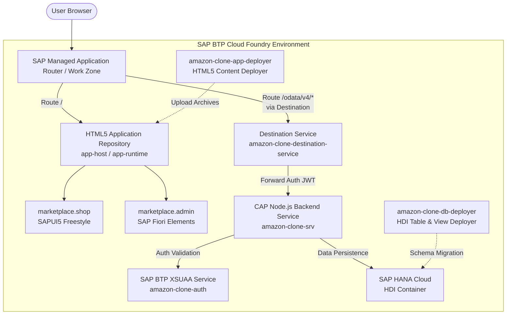

# SAP BTP Cloud Foundry Deployment Guide
## Aura Enterprise Marketplace Multitarget Application (MTA)

This guide provides the complete end-to-end instructions for building, packaging, deploying, and operating the Aura Enterprise Marketplace Multitarget Application (MTA) on **SAP Business Technology Platform (SAP BTP) Cloud Foundry Environment**.

---

## 1. Architecture Overview

The application is structured as a cloud-native SAP Multitarget Application (MTA) adhering to SAP Cloud Application Programming Model (CAP) and SAP Fiori architecture standards.



### MTA Components

| Component / Module | Type | Description |
| :--- | :--- | :--- |
| **`amazon-clone-srv`** | `nodejs` | Core CAP backend exposing 7 OData V4 services (Catalog, Cart, Customer, Order, Payment, Inventory, Admin). |
| **`amazon-clone-db-deployer`** | `hdb` | Node.js container runner executing `@sap/hdi-deploy` to provision tables, CDS views, and constraints in SAP HANA Cloud. |
| **`amazon-clone-app-deployer`** | `com.sap.application.content` | Deploys packaged `.zip` archives of the UI applications to the HTML5 Application Repository. |
| **`marketplace-shop`** | `html5` | Customer-facing SAPUI5 freestyle storefront application (`marketplace.shop`). |
| **`marketplace-admin`** | `html5` | Backoffice SAP Fiori Elements administrative application (`marketplace.admin`). |

---

## 2. Required SAP BTP Service Instances & Plans

The deployment descriptor [`mta.yaml`](file:///D:/Visual%20Studio%20Code%20Projects/Anti%20Gravity/amazon-clone/mta.yaml) automatically provisions and binds the following managed services in your Cloud Foundry space:

| Service Name in MTA | BTP Service | Service Plan | Purpose |
| :--- | :--- | :--- | :--- |
| **`amazon-clone-auth`** | `xsuaa` | `application` | OAuth2 authentication, role templates (`Customer`, `Seller`, `ProductManager`, `OrderManager`, `InventoryManager`, `Administrator`), and token exchange using [`xs-security.json`](file:///D:/Visual%20Studio%20Code%20Projects/Anti%20Gravity/amazon-clone/xs-security.json). |
| **`amazon-clone-db`** | `hana` | `hdi-shared` | Provisions an isolated HDI container within an SAP HANA Cloud database instance for relational data storage and schema management. |
| **`amazon-clone-html5-repo-host`** | `html5-apps-repo` | `app-host` | Secure cloud storage bucket for hosting the compiled HTML5 UI archives (`marketplace-shop.zip` and `marketplace-admin.zip`). |
| **`amazon-clone-destination-service`** | `destination` | `lite` | Manages runtime routing destinations (`amazon-clone-srv-api`, `ui5`) with dynamic user token forwarding (`HTML5.ForwardAuthToken: true`). |

> [!IMPORTANT]
> **Subaccount Entitlements**: Before deploying, ensure your BTP subaccount has been assigned sufficient quota for:
> - `hana` (`hdi-shared`: at least 1 quota)
> - `xsuaa` (`application`: at least 1 quota)
> - `html5-apps-repo` (`app-host`: at least 1 quota)
> - `destination` (`lite`: at least 1 quota)
> - Cloud Foundry Application Runtime (at least 1.5 GB memory quota)

---

## 3. Destination & Application Router Routing

Both UI applications consume the CAP backend services through destinations managed by the Destination service and evaluated by the Managed Application Router.

### Destination Definition in `mta.yaml`
```yaml
destinations:
  - Name: amazon-clone-srv-api
    Description: Aura Marketplace CAP Backend Service
    URL: ~{srv-api/srv-url}
    Authentication: NoAuthentication
    ProxyType: Internet
    Type: HTTP
    HTML5.DynamicDestination: true
    HTML5.ForwardAuthToken: true
  - Name: ui5
    Description: SAPUI5 Content Delivery Network
    URL: https://ui5.sap.com
    Authentication: NoAuthentication
    ProxyType: Internet
    Type: HTTP
```

### Routing Rules (`xs-app.json`)
Both UI applications include an `xs-app.json` configuration file at their root:
- **Storefront (`app/shop-ui/xs-app.json`)**:
  ```json
  {
    "welcomeFile": "/index.html",
    "authenticationMethod": "route",
    "routes": [
      {
        "source": "^/odata/v4/(.*)$",
        "target": "/odata/v4/$1",
        "destination": "amazon-clone-srv-api",
        "authenticationType": "none",
        "csrfProtection": false
      },
      {
        "source": "^(.*)$",
        "target": "$1",
        "service": "html5-apps-repo-rt",
        "authenticationType": "none"
      }
    ]
  }
  ```
- **Admin Portal (`app/admin-ui/xs-app.json`)**:
  ```json
  {
    "welcomeFile": "/index.html",
    "authenticationMethod": "route",
    "routes": [
      {
        "source": "^/odata/v4/(.*)$",
        "target": "/odata/v4/$1",
        "destination": "amazon-clone-srv-api",
        "authenticationType": "xsuaa",
        "csrfProtection": false
      },
      {
        "source": "^(.*)$",
        "target": "$1",
        "service": "html5-apps-repo-rt",
        "authenticationType": "xsuaa"
      }
    ]
  }
  ```

---

## 4. Local Build & MTA Packaging

### Prerequisites
Ensure the following tools are installed locally:
- **Node.js** (v18, v20, or v22 LTS)
- **npm** (v9+)
- **Cloud MTA Build Tool (MBT)**:
  ```bash
  npm install -g mbt
  ```
- **Cloud Foundry CLI** (v7 or v8):
  ```bash
  # Verify installation
  cf --version
  ```
- **MultiApps Plugin** for CF CLI:
  ```bash
  cf install-plugin multiapps
  ```

### Step 1: Install Dependencies
From the project root:
```bash
npm install
```

### Step 2: Compile & Build
Run the unified build command which compiles CAP artifacts for production and packages both UI applications:
```bash
npm run build
```
This triggers:
1. `cds build --production`: Compiles CDS models into `gen/srv` (Node.js) and `gen/db` (SAP HANA HDI artifacts).
2. `npm run build:ui`: Runs [`scripts/build-ui.js`](file:///D:/Visual%20Studio%20Code%20Projects/Anti%20Gravity/amazon-clone/scripts/build-ui.js) to package `marketplace-shop.zip` and `marketplace-admin.zip`.

### Step 3: Package MTAR with Cloud MTA Build Tool
```bash
mbt build
```
The build tool parses [`mta.yaml`](file:///D:/Visual%20Studio%20Code%20Projects/Anti%20Gravity/amazon-clone/mta.yaml), packages all modules, builds deployment metadata (`mtad.yaml`, `MANIFEST.MF`), and produces the deployable MTA archive:
```
mta_archives/amazon-clone_1.0.0.mtar
```

---

## 5. Deployment to SAP BTP Cloud Foundry

### Step 1: Cloud Foundry Login
Log in to your SAP BTP Cloud Foundry landscape. Use your regional API endpoint (e.g., Frankfurt `api.cf.eu10.hana.ondemand.com`, US East `api.cf.us10.hana.ondemand.com`):

```bash
# Interactive login with SSO (Recommended for Enterprise Accounts)
cf login -a <CF_API_ENDPOINT> --sso

# Standard interactive login (prompts securely for credentials)
cf login -a <CF_API_ENDPOINT>
```

> [!CAUTION]
> Never hardcode or pass plain-text passwords via CLI arguments (`-u` or `-p`) in production scripts or CI/CD logs. Always use SSO, interactive prompts, or BTP Service Keys / Technical User tokens in CI/CD pipelines.

### Step 2: Set Cloud Foundry Target Org and Space
Select the target Organization and Space where the services and database instance reside:
```bash
cf target -o <YOUR_BTP_ORG_NAME> -s <YOUR_TARGET_SPACE>
```
Verify the target configuration:
```bash
cf target
```

### Step 3: Deploy the MTA Archive
Deploy the generated archive using the Cloud Foundry MultiApps deployer plugin:
```bash
cf deploy mta_archives/amazon-clone_1.0.0.mtar
```

#### Recommended Production Flags:
```bash
# Rolling execution with retry policy
cf deploy mta_archives/amazon-clone_1.0.0.mtar --strategy rolling --retries 2
```

---

## 6. Post-Deployment Verification

### 1. Verify Cloud Foundry Applications
Check that the backend service and database deployer executed successfully:
```bash
cf apps
```
Expected output:
```
name               requested state   instances   memory   disk   urls
amazon-clone-srv   started           1/1         512M     1G     amazon-clone-srv-<space>.<domain>
```
*(Note: `amazon-clone-db-deployer` will show as `stopped` once migration finishes, which is expected for task/deployer apps).*

### 2. Verify Service Instances
Verify that all four required managed services are created and bound:
```bash
cf services
```
Expected services:
- `amazon-clone-auth` (`xsuaa`, `application`)
- `amazon-clone-db` (`hana`, `hdi-shared`)
- `amazon-clone-destination-service` (`destination`, `lite`)
- `amazon-clone-html5-repo-host` (`html5-apps-repo`, `app-host`)

### 3. Check Real-Time Logs
To monitor backend logs during startup or live requests:
```bash
cf logs amazon-clone-srv --recent
```

### 4. Assign Role Collections in SAP BTP Cockpit
Log in to the **SAP BTP Cockpit**:
1. Navigate to **Subaccount** > **Security** > **Users**.
2. Select your administrator or business user.
3. Under **Role Collections**, assign the desired roles defined by [`xs-security.json`](file:///D:/Visual%20Studio%20Code%20Projects/Anti%20Gravity/amazon-clone/xs-security.json):
   - `MarketplaceAdministrator` (Superuser administrative access)
   - `MarketplaceProductManager` (Catalog & Promotions)
   - `MarketplaceOrderManager` (Logistics, Orders & Shipments)
   - `MarketplaceInventoryManager` (Warehouse Stock & Allocations)
   - `MarketplaceSeller` (Merchant Operations)
   - `MarketplaceCustomer` (Storefront Shopper)

### 5. Accessing the HTML5 Applications
Once deployed, the applications are accessible via:
1. **SAP Build Work Zone (Standard Edition) / SAP Fiori Launchpad**:
   - The HTML5 apps are automatically discovered in Content Manager > HTML5 Apps.
   - Add `marketplace.shop` and `marketplace.admin` to your site pages.
2. **Direct Managed App Router URL**:
   - URL format: `https://<subaccount-subdomain>.launchpad.cfapps.<region>.hana.ondemand.com/marketplace.shop-1.0.0/`
   - URL format: `https://<subaccount-subdomain>.launchpad.cfapps.<region>.hana.ondemand.com/marketplace.admin-1.0.0/`

---

## 7. Undeployment & Cleanup

To remove the deployed application and all its service bindings:
```bash
cf undeploy amazon-clone --delete-services
```
*(Omit `--delete-services` if you wish to preserve the SAP HANA database HDI container).*
