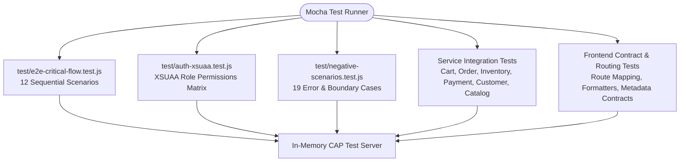

# Testing & Quality Assurance Guide

**Project:** Aura Enterprise Marketplace  
**Test Framework:** Mocha + Chai + `@cap-js/cds-test`  
**Total Test Count:** 136 automated tests  
**Pass Rate:** 100%  

---

## 1. Test Architecture Overview

The testing framework combines unit testing, integration contract validation, end-to-end customer journey testing, and security authorization matrix verification:



---

## 2. Test Suites Summary

| Test File | Test Cases | Scope & Verification |
| :--- | :--- | :--- |
| [`test/e2e-critical-flow.test.js`](file:///D:/Visual%20Studio%20Code%20Projects/Anti%20Gravity/amazon-clone/test/e2e-critical-flow.test.js) | 12 | Complete 12-scenario sequential customer journey from browsing to rating. |
| [`test/auth-xsuaa.test.js`](file:///D:/Visual%20Studio%20Code%20Projects/Anti%20Gravity/amazon-clone/test/auth-xsuaa.test.js) | 40 | Exhaustive role matrix testing Anonymous, Customer, Seller, Managers, Admin. |
| [`test/negative-scenarios.test.js`](file:///D:/Visual%20Studio%20Code%20Projects/Anti%20Gravity/amazon-clone/test/negative-scenarios.test.js) | 19 | Over-allocation, expired coupons, payment decline, unauthorized access. |
| [`test/customer-service.test.js`](file:///D:/Visual%20Studio%20Code%20Projects/Anti%20Gravity/amazon-clone/test/customer-service.test.js) | 6 | Profile, address creation, wishlist, notifications, data isolation. |
| [`test/payment-service.test.js`](file:///D:/Visual%20Studio%20Code%20Projects/Anti%20Gravity/amazon-clone/test/payment-service.test.js) | 5 | Payment creation, duplicate prevention, refunds, simulated failures. |
| [`test/cart.test.js`](file:///D:/Visual%20Studio%20Code%20Projects/Anti%20Gravity/amazon-clone/test/cart.test.js) | 11 | Cart additions, calculations, stock checks, coupons, item removals. |
| [`test/catalog.test.js`](file:///D:/Visual%20Studio%20Code%20Projects/Anti%20Gravity/amazon-clone/test/catalog.test.js) | 4 | Catalog read, review submission, rating aggregation, helpful votes. |
| [`test/checkout-order.test.js`](file:///D:/Visual%20Studio%20Code%20Projects/Anti%20Gravity/amazon-clone/test/checkout-order.test.js) | 7 | 18-step checkout, stock commits, cancellations, returns, audit logs. |
| [`test/inventory-admin.test.js`](file:///D:/Visual%20Studio%20Code%20Projects/Anti%20Gravity/amazon-clone/test/inventory-admin.test.js) | 11 | Reservations, warehouse count sync, review moderation, seller approval. |
| [`test/frontend-routing-controller.test.js`](file:///D:/Visual%20Studio%20Code%20Projects/Anti%20Gravity/amazon-clone/test/frontend-routing-controller.test.js) | 13 | 17 Shop routes, 19 Admin routes, view existence, formatters unit tests. |
| [`test/frontend-odata-integration.test.js`](file:///D:/Visual%20Studio%20Code%20Projects/Anti%20Gravity/amazon-clone/test/frontend-odata-integration.test.js) | 8 | Manifest dataSources EDMX validation & UI view property binding parity. |

---

## 3. Running Tests

### Execute All Tests
```bash
npm test
```
Runs Mocha with automatic CAP test server instantiation and in-memory SQLite database seeding.

### Execute Specific Suite
```bash
npx mocha test/e2e-critical-flow.test.js --timeout 15000 --exit
npx mocha test/auth-xsuaa.test.js --timeout 15000 --exit
npx mocha test/negative-scenarios.test.js --timeout 15000 --exit
```

### Static Analysis & Lint Verification
```bash
npm run lint
# or
npx cds lint
```

---

## 4. 12 Critical End-to-End Scenarios

Executed in strict sequence in [`test/e2e-critical-flow.test.js`](file:///D:/Visual%20Studio%20Code%20Projects/Anti%20Gravity/amazon-clone/test/e2e-critical-flow.test.js):

1. **Browse Catalog**: Unauthenticated customer retrieves active categories and hero products.
2. **Search Product**: Filters catalog by keyword (`contains(title, 'Headphones')`).
3. **Open Product**: Reads deep details with variants, seller offers, images, and customer reviews.
4. **Add to Cart**: Authenticates as customer Alice and adds item to cart.
5. **Change Quantity**: Updates item quantity and validates subtotal, tax, and total recalculation.
6. **Apply Coupon**: Applies promo coupon `SAVE10` and validates discount deduction.
7. **Checkout**: Calls `/odata/v4/order/checkout` with address, delivery, and payment options.
8. **Payment Success**: Verifies payment record captured with gateway transaction reference.
9. **Order Creation**: Verifies created order with `CONFIRMED` status and snapshotted line items.
10. **Order History**: Queries customer order history and validates placed order presence.
11. **Cancel Order**: Cancels placed order; validates warehouse restock and payment refund.
12. **Product Review**: Submits customer review; validates product rating and review count recalculation.

---

## 5. Adding New Tests

When writing new tests:
1. Use `const { GET, POST, axios } = cds.test('.');` to bind to the test server.
2. Clear authentication after tests using `afterEach(() => { axios.defaults.auth = undefined; });`.
3. Set appropriate mock authentication headers:
   ```javascript
   axios.defaults.auth = { username: 'alice', password: '' };
   ```
4. Query OData V4 entity sets and actions using `/odata/v4/<service>/<entityOrAction>`.
