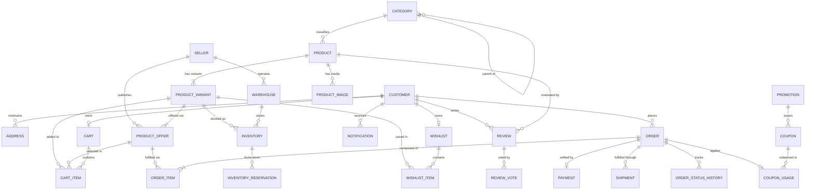

# Enterprise Entity Relationship Design & Data Model
**Platform:** SAP Cloud Application Programming Model (CDS / SAP HANA Cloud)  
**Specification:** Complete Domain Data Dictionary & Schema Definition  
**Version:** 1.0.0 (Production Blueprint)  

---

## 1. Entity-Relationship Overview

The enterprise marketplace data model is partitioned into six cohesive domains:
1. **Identity & Customer Domain:** `Customer`, `Address`
2. **Product Catalog & Seller Domain:** `Category`, `Product`, `ProductVariant`, `ProductImage`, `ProductOffer`, `Seller`
3. **Inventory & Warehouse Domain:** `Inventory`, `Warehouse`, `InventoryReservation`
4. **Shopping Cart & Engagement Domain:** `Cart`, `CartItem`, `Wishlist`, `WishlistItem`
5. **Sales Order & Fulfillment Domain:** `Order`, `OrderItem`, `OrderStatusHistory`, `Payment`, `Shipment`
6. **Marketing, Rating & Communications Domain:** `Review`, `ReviewVote`, `Promotion`, `Coupon`, `CouponUsage`, `Notification`



---

## 2. Common Aspects & Reusable Types

All entities inherit enterprise capabilities through standardized CDS aspects:
- **`cuid`:** Universal Unique Identifier (`ID: UUID`).
- **`managed`:** Enterprise audit logging (`createdAt: Timestamp`, `createdBy: User`, `modifiedAt: Timestamp`, `modifiedBy: User`).
- **`Money`:** Compound structure holding `amount: Decimal(15,2)` and `currency: Currency (String(3))`.
- **`AddressType`:** Reusable physical address structure (Street, City, Postal Code, State, Country).
- **Domain Status Codes:** Explicit CDS Enums preventing invalid state mutations.

---

## 3. Exhaustive Entity Specification

---

### Domain 1: Identity & Customer

#### 1. `Customer`
- **Business Purpose:** Master record for individual consumers. Stores account profile, authentication link (XSUAA `sub` / identity provider ID), preferences, and communication flags.
- **Primary Key:** `ID: UUID`
- **Fields:**
  | Field Name | Data Type | Nullable | Constraints / Default | Description |
  | :--- | :--- | :--- | :--- | :--- |
  | `ID` | `UUID` | No | PK (`cuid`) | Unique surrogate identifier |
  | `externalUserId` | `String(128)` | No | `@assert.unique` | XSUAA identity token identifier (`$user.id`) |
  | `firstName` | `String(60)` | No | `@assert.notEmpty` | Customer given name |
  | `lastName` | `String(60)` | No | `@assert.notEmpty` | Customer family name |
  | `email` | `String(255)` | No | `@assert.format: email`, Unique | Contact & authentication email address |
  | `phoneNumber` | `String(30)` | Yes | International E.164 format | Mobile phone number for SMS notifications |
  | `status` | `String(20)` | No | Default: `'ACTIVE'`, Enum | Status: `ACTIVE`, `SUSPENDED`, `LOCKED` |
  | `isEmailVerified`| `Boolean` | No | Default: `false` | Email verification flag |
  | `preferredCurrency` | `Currency` | No | Default: `'USD'` | Preferred display currency (ISO 4217) |
  | `preferredLanguage` | `String(5)` | No | Default: `'en'` | Preferred locale (IETF BCP 47) |
  | `createdAt` | `Timestamp` | No | Managed | Audit creation timestamp |
  | `createdBy` | `String(255)` | No | Managed | Audit creation user |
  | `modifiedAt` | `Timestamp` | Yes | Managed | Audit modification timestamp |
  | `modifiedBy` | `String(255)` | Yes | Managed | Audit modification user |
- **Compositions:**
  - `addresses`: Composition of many `Address` on `addresses.customer = $self` (Cascaded deletion).
- **Associations:**
  - `cart`: Association to one `Cart` on `cart.customer = $self`.
  - `wishlist`: Association to one `Wishlist` on `wishlist.customer = $self`.
  - `orders`: Association to many `Order` on `orders.customer = $self`.
  - `reviews`: Association to many `Review` on `reviews.customer = $self`.
  - `notifications`: Association to many `Notification` on `notifications.customer = $self`.

#### 2. `Address`
- **Business Purpose:** Represents physical delivery destinations and legal billing endpoints associated with customers and warehouses.
- **Primary Key:** `ID: UUID`
- **Fields:**
  | Field Name | Data Type | Nullable | Constraints / Default | Description |
  | :--- | :--- | :--- | :--- | :--- |
  | `ID` | `UUID` | No | PK (`cuid`) | Unique identifier |
  | `customer` | `Association to Customer` | No | Foreign Key | Owning customer reference |
  | `type` | `String(20)` | No | Default: `'SHIPPING'` | Enum: `SHIPPING`, `BILLING`, `WAREHOUSE` |
  | `isDefault` | `Boolean` | No | Default: `false` | Flag indicating default selection |
  | `fullName` | `String(120)` | No | Recipient name | Contact person receiving goods |
  | `streetName` | `String(150)` | No | Street address line 1 | Physical street and building |
  | `apartmentSuite` | `String(50)` | Yes | Street address line 2 | Suite, apartment, unit or PO Box |
  | `city` | `String(80)` | No | Mandatory | City / municipality |
  | `stateProvince` | `String(80)` | Yes | State / province | State, province or region |
  | `postalCode` | `String(20)` | No | Valid format | Postal / ZIP code |
  | `countryCode` | `String(3)` | No | ISO 3166-1 alpha-3 | Country identifier (e.g. `USA`, `DEU`) |
  | `phone` | `String(30)` | Yes | Carrier contact | Delivery driver contact phone |
  | `deliveryInstructions` | `String(500)` | Yes | Optional | Gate codes or drop-off instructions |

---

### Domain 2: Product Catalog & Multi-Vendor Marketplace

#### 3. `Category`
- **Business Purpose:** Adjacency-list hierarchical taxonomy organizing products into multi-level categories (e.g., Electronics $\rightarrow$ Computers $\rightarrow$ Laptops).
- **Primary Key:** `ID: UUID`
- **Fields:**
  | Field Name | Data Type | Nullable | Constraints / Default | Description |
  | :--- | :--- | :--- | :--- | :--- |
  | `ID` | `UUID` | No | PK (`cuid`) | Unique identifier |
  | `code` | `String(50)` | No | Unique slug | URL-safe slug (e.g. `laptops-notebooks`) |
  | `name` | `localized String(100)`| No | Translatable | Localized category name |
  | `description` | `localized String(500)`| Yes | Translatable | Localized category overview |
  | `parent` | `Association to Category` | Yes | Self-association | Parent category node |
  | `level` | `Integer` | No | Default: `1`, Range: 1..5 | Depth in hierarchy tree |
  | `displayOrder` | `Integer` | No | Default: `0` | Sort order within same level |
  | `imageUrl` | `String(1000)` | Yes | Media reference | Banner or thumbnail icon URI |
  | `isActive` | `Boolean` | No | Default: `true` | Catalog visibility switch |
- **Compositions:**
  - `children`: Composition of many `Category` on `children.parent = $self`.
- **Associations:**
  - `products`: Association to many `Product` on `products.category = $self`.

#### 4. `Product`
- **Business Purpose:** The canonical master product definition representing the conceptual item independent of size, color, or seller offering.
- **Primary Key:** `ID: UUID`
- **Fields:**
  | Field Name | Data Type | Nullable | Constraints / Default | Description |
  | :--- | :--- | :--- | :--- | :--- |
  | `ID` | `UUID` | No | PK (`cuid`) | Unique identifier |
  | `sku` | `String(60)` | No | Unique index | Master Stock Keeping Unit |
  | `brand` | `String(100)` | No | Brand/Manufacturer | e.g. "Apple", "Samsung", "Sony" |
  | `title` | `localized String(255)`| No | Translatable | Product display title |
  | `description` | `localized LargeString`| Yes | Translatable | Rich HTML or markdown description |
  | `category` | `Association to Category` | No | Mandatory | Owning category |
  | `status` | `String(20)` | No | Default: `'ACTIVE'` | Enum: `DRAFT`, `ACTIVE`, `DISCONTINUED` |
  | `averageRating`| `Decimal(3,2)` | No | Default: `0.00`, Range: 0..5 | Denormalized running average rating |
  | `reviewCount` | `Integer` | No | Default: `0` | Total approved reviews |
  | `isFeatured` | `Boolean` | No | Default: `false` | Highlighted on storefront homepage |
- **Compositions:**
  - `variants`: Composition of many `ProductVariant` on `variants.product = $self`.
  - `images`: Composition of many `ProductImage` on `images.product = $self`.
- **Associations:**
  - `reviews`: Association to many `Review` on `reviews.product = $self`.

#### 5. `ProductVariant`
- **Business Purpose:** Specific sellable SKU representing concrete physical dimensions, colors, sizes, and specs (e.g., iPhone 15 Pro, Space Black, 256GB).
- **Primary Key:** `ID: UUID`
- **Fields:**
  | Field Name | Data Type | Nullable | Constraints / Default | Description |
  | :--- | :--- | :--- | :--- | :--- |
  | `ID` | `UUID` | No | PK (`cuid`) | Unique identifier |
  | `product` | `Association to Product` | No | Parent reference | Master product |
  | `variantSku` | `String(80)` | No | Unique index | Specific barcode / SKU |
  | `gtinEan` | `String(14)` | Yes | Global trade item | 13-14 digit UPC/EAN barcode |
  | `attributes` | `LargeString` | Yes | JSON string | Key-value attributes (e.g. `{"color":"Black","storage":"256GB"}`) |
  | `weightKg` | `Decimal(8,3)` | Yes | `@assert.range: [0, 9999]` | Physical weight for shipping estimation |
  | `dimensionsCm` | `String(50)` | Yes | E.g. "15x7.5x0.8" | Length x Width x Height |
  | `isActive` | `Boolean` | No | Default: `true` | SKU availability flag |
- **Compositions:**
  - `offers`: Composition of many `ProductOffer` on `offers.variant = $self`.
- **Associations:**
  - `inventory`: Association to many `Inventory` on `inventory.variant = $self`.

#### 6. `ProductImage`
- **Business Purpose:** Media gallery management containing high-resolution product photography, lifestyle shots, and thumbnail variants.
- **Primary Key:** `ID: UUID`
- **Fields:**
  | Field Name | Data Type | Nullable | Constraints / Default | Description |
  | :--- | :--- | :--- | :--- | :--- |
  | `ID` | `UUID` | No | PK (`cuid`) | Unique identifier |
  | `product` | `Association to Product` | No | Parent reference | Owning product |
  | `mediaUrl` | `String(1000)` | No | Valid URI | S3/Object Store URI |
  | `altText` | `String(255)` | Yes | Accessibility | Screen-reader description |
  | `displayOrder` | `Integer` | No | Default: `0` | Order index in gallery carousel |
  | `isHero` | `Boolean` | No | Default: `false` | Main thumbnail hero image |

#### 7. `Seller`
- **Business Purpose:** 3rd-party vendor organization profile, performance rating, legal tax identifiers, and merchant settlement status.
- **Primary Key:** `ID: UUID`
- **Fields:**
  | Field Name | Data Type | Nullable | Constraints / Default | Description |
  | :--- | :--- | :--- | :--- | :--- |
  | `ID` | `UUID` | No | PK (`cuid`) | Unique identifier |
  | `externalSellerId`| `String(128)` | No | Unique index | XSUAA business partner identity |
  | `storeName` | `String(100)` | No | Unique index | Public storefront name |
  | `legalEntity` | `String(150)` | No | Legal register name| Registered corporate entity |
  | `taxId` | `String(50)` | No | Encrypted / audited| VAT / EIN / GST registration |
  | `contactEmail` | `String(255)` | No | Email format | Merchant operations contact |
  | `rating` | `Decimal(3,2)` | No | Default: `5.00` | Merchant fulfillment reputation (1-5) |
  | `status` | `String(20)` | No | Default: `'PENDING'` | Enum: `PENDING`, `APPROVED`, `SUSPENDED` |
  | `commissionRate`| `Decimal(5,2)` | No | Default: `12.50` | Platform take-rate percentage |
- **Associations:**
  - `offers`: Association to many `ProductOffer` on `offers.seller = $self`.
  - `warehouses`: Association to many `Warehouse` on `warehouses.seller = $self`.

#### 8. `ProductOffer`
- **Business Purpose:** The marketplace pricing contract ("Buy Box" competitor). Connects a Seller with a ProductVariant specifying price, condition, warranty, and dispatch time.
- **Primary Key:** `ID: UUID`
- **Fields:**
  | Field Name | Data Type | Nullable | Constraints / Default | Description |
  | :--- | :--- | :--- | :--- | :--- |
  | `ID` | `UUID` | No | PK (`cuid`) | Unique identifier |
  | `variant` | `Association to ProductVariant` | No | Variant link | Targeted product variant |
  | `seller` | `Association to Seller` | No | Vendor link | Fulfilling merchant |
  | `price` | `Decimal(15,2)`| No | `@assert.range: [0.01, 999999]` | Current selling price |
  | `currency` | `Currency` | No | Default: `'USD'` | Price currency |
  | `originalPrice`| `Decimal(15,2)`| Yes | Strikethrough price | MSRP / Original benchmark price |
  | `condition` | `String(20)` | No | Default: `'NEW'` | Enum: `NEW`, `REFURBISHED`, `USED_LIKE_NEW` |
  | `leadTimeDays` | `Integer` | No | Default: `1` | Dispatch handling time |
  | `isBuyBoxWinner`| `Boolean` | No | Default: `false` | Algorithmic winning offer on PDP |
  | `isActive` | `Boolean` | No | Default: `true` | Offer visibility switch |

---

### Domain 3: Inventory & Warehouse Logistics

#### 9. `Warehouse`
- **Business Purpose:** Physical storage facility or fulfillment center where inventory resides. Can be platform-managed (FBA style) or merchant-managed (3P).
- **Primary Key:** `ID: UUID`
- **Fields:**
  | Field Name | Data Type | Nullable | Constraints / Default | Description |
  | :--- | :--- | :--- | :--- | :--- |
  | `ID` | `UUID` | No | PK (`cuid`) | Unique identifier |
  | `code` | `String(20)` | No | Unique index | Facility code (e.g. `FC-US-EAST-01`) |
  | `name` | `String(100)` | No | Descriptive name | Facility location name |
  | `seller` | `Association to Seller` | Yes | Optional | Null if platform-managed, or linked to 3P |
  | `address` | `Association to Address`| No | Physical location | Delivery/dispatch address |
  | `isActive` | `Boolean` | No | Default: `true` | Operational status |

#### 10. `Inventory`
- **Business Purpose:** Real-time stock counts at a specific warehouse location for a given SKU variant.
- **Primary Key:** `ID: UUID`
- **Fields:**
  | Field Name | Data Type | Nullable | Constraints / Default | Description |
  | :--- | :--- | :--- | :--- | :--- |
  | `ID` | `UUID` | No | PK (`cuid`) | Unique identifier |
  | `variant` | `Association to ProductVariant` | No | SKU link | Managed variant |
  | `warehouse` | `Association to Warehouse` | No | Facility link | Storage facility |
  | `quantityOnHand` | `Integer` | No | Default: `0`, $\ge 0$ | Physical total units in bin |
  | `quantityReserved`| `Integer` | No | Default: `0`, $\ge 0$ | Locked for active checkout / processing |
  | `reorderThreshold`| `Integer` | No | Default: `10` | Low-stock notification trigger |
- **Calculated Virtual Fields:**
  - `quantityAvailable`: `Integer` = `quantityOnHand - quantityReserved`
- **Compositions:**
  - `reservations`: Composition of many `InventoryReservation` on `reservations.inventory = $self`.

#### 11. `InventoryReservation` (Supporting Transactional Entity)
- **Business Purpose:** Holds temporary holds on stock while a customer proceeds through checkout, expiring automatically if payment is abandoned.
- **Primary Key:** `ID: UUID`
- **Fields:**
  | Field Name | Data Type | Nullable | Constraints / Default | Description |
  | :--- | :--- | :--- | :--- | :--- |
  | `ID` | `UUID` | No | PK (`cuid`) | Unique reservation identifier |
  | `inventory` | `Association to Inventory` | No | Stock reference | Targeted inventory row |
  | `order` | `Association to Order` | Yes | Order reference | Linked order (null during initial checkout) |
  | `quantity` | `Integer` | No | $> 0$ | Number of units held |
  | `status` | `String(20)` | No | Default: `'RESERVED'` | Enum: `RESERVED`, `COMMITTED`, `RELEASED`, `EXPIRED` |
  | `expiresAt` | `Timestamp` | No | Default: `+15 minutes` | Timestamp when hold automatically expires |

---

### Domain 4: Shopping Cart & Engagement

#### 12. `Cart`
- **Business Purpose:** Active shopping session container. Persisted per authenticated customer or anonymous guest token.
- **Primary Key:** `ID: UUID`
- **Fields:**
  | Field Name | Data Type | Nullable | Constraints / Default | Description |
  | :--- | :--- | :--- | :--- | :--- |
  | `ID` | `UUID` | No | PK (`cuid`) | Unique identifier |
  | `customer` | `Association to Customer` | Yes | Unique index | Owner (null for guest checkout) |
  | `guestToken` | `String(64)` | Yes | Unique index | Ephemeral cookie token for unauthenticated cart |
  | `appliedCoupon`| `Association to Coupon` | Yes | Active discount | Verified discount coupon |
  | `currency` | `Currency` | No | Default: `'USD'` | Pricing currency |
  | `subtotalAmount`| `Decimal(15,2)`| No | Default: `0.00` | Sum of item lines |
  | `discountAmount`| `Decimal(15,2)`| No | Default: `0.00` | Calculated coupon discount |
  | `shippingEstimate`| `Decimal(15,2)`| No | Default: `0.00` | Real-time shipping calculation |
  | `taxEstimate` | `Decimal(15,2)`| No | Default: `0.00` | Estimated VAT / Sales tax |
  | `totalAmount` | `Decimal(15,2)`| No | Default: `0.00` | Net payable total |
- **Compositions:**
  - `items`: Composition of many `CartItem` on `items.cart = $self` (Cascaded deletion).

#### 13. `CartItem`
- **Business Purpose:** Specific line item in a cart representing a quantity of a selected seller's offer.
- **Primary Key:** `ID: UUID`
- **Fields:**
  | Field Name | Data Type | Nullable | Constraints / Default | Description |
  | :--- | :--- | :--- | :--- | :--- |
  | `ID` | `UUID` | No | PK (`cuid`) | Unique identifier |
  | `cart` | `Association to Cart` | No | Parent reference | Owning cart |
  | `offer` | `Association to ProductOffer` | No | Active offer | Fulfilling seller and price |
  | `variant` | `Association to ProductVariant` | No | SKU link | Product variant details |
  | `quantity` | `Integer` | No | Default: `1`, Range: 1..99 | Desired purchase count |
  | `unitPrice` | `Decimal(15,2)`| No | Snapshotted price | Price at the moment of adding |
  | `extendedPrice`| `Decimal(15,2)`| No | Computed | `quantity * unitPrice` |

#### 14. `Wishlist`
- **Business Purpose:** Saved-for-later or gift registry collection belonging to a customer.
- **Primary Key:** `ID: UUID`
- **Fields:**
  | Field Name | Data Type | Nullable | Constraints / Default | Description |
  | :--- | :--- | :--- | :--- | :--- |
  | `ID` | `UUID` | No | PK (`cuid`) | Unique identifier |
  | `customer` | `Association to Customer` | No | Unique index | Owning customer |
  | `title` | `String(100)` | No | Default: `'My Wishlist'` | List name |
  | `isPublic` | `Boolean` | No | Default: `false` | Shareable link flag |
- **Compositions:**
  - `items`: Composition of many `WishlistItem` on `items.wishlist = $self`.

#### 15. `WishlistItem`
- **Business Purpose:** Product variant pinned to a customer's wishlist.
- **Primary Key:** `ID: UUID`
- **Fields:**
  | Field Name | Data Type | Nullable | Constraints / Default | Description |
  | :--- | :--- | :--- | :--- | :--- |
  | `ID` | `UUID` | No | PK (`cuid`) | Unique identifier |
  | `wishlist` | `Association to Wishlist` | No | Parent reference | Owning wishlist |
  | `product` | `Association to Product` | No | Master product | Product link |
  | `variant` | `Association to ProductVariant` | Yes | Optional | Specific desired variant |
  | `targetPrice` | `Decimal(15,2)`| Yes | Price alert trigger| Alert customer if price falls below this |

---

### Domain 5: Sales Order & Fulfillment

#### 16. `Order`
- **Business Purpose:** Legally binding sales contract resulting from checkout. Acts as the root aggregate of the fulfillment lifecycle.
- **Primary Key:** `ID: UUID`
- **Fields:**
  | Field Name | Data Type | Nullable | Constraints / Default | Description |
  | :--- | :--- | :--- | :--- | :--- |
  | `ID` | `UUID` | No | PK (`cuid`) | Surrogate identifier |
  | `orderNumber` | `String(32)` | No | Unique human readable | E.g. `ORD-20260923-87214` |
  | `customer` | `Association to Customer` | No | Buyer reference | Purchasing customer |
  | `shippingAddress` | `Association to Address` | No | Delivery endpoint | Physical destination |
  | `billingAddress` | `Association to Address` | No | Invoicing endpoint | Billing legal destination |
  | `status` | `String(25)` | No | Default: `'PENDING_PAYMENT'` | Enum: `PENDING_PAYMENT`, `CONFIRMED`, `PROCESSING`, `SHIPPED`, `DELIVERED`, `CANCELLED`, `RETURNED` |
  | `paymentStatus` | `String(20)` | No | Default: `'UNPAID'` | Enum: `UNPAID`, `AUTHORIZED`, `PAID`, `REFUNDED`, `FAILED` |
  | `fulfillmentStatus` | `String(20)` | No | Default: `'UNFULFILLED'` | Enum: `UNFULFILLED`, `PARTIAL`, `FULFILLED`, `RETURNED` |
  | `currency` | `Currency` | No | ISO code | Monetary currency |
  | `subtotal` | `Decimal(15,2)`| No | Mandatory | Items subtotal |
  | `discount` | `Decimal(15,2)`| No | Default: `0.00` | Total discount subtracted |
  | `shippingCost` | `Decimal(15,2)`| No | Default: `0.00` | Freight cost |
  | `taxAmount` | `Decimal(15,2)`| No | Mandatory | Total calculated tax |
  | `totalAmount` | `Decimal(15,2)`| No | Mandatory | Grand total payable |
  | `cancellationReason` | `String(255)` | Yes | Audit | Reason if cancelled |
- **Compositions:**
  - `items`: Composition of many `OrderItem` on `items.order = $self`.
  - `history`: Composition of many `OrderStatusHistory` on `history.order = $self`.
- **Associations:**
  - `payment`: Association to one `Payment` on `payment.order = $self`.
  - `shipments`: Association to many `Shipment` on `shipments.order = $self`.

#### 17. `OrderItem`
- **Business Purpose:** Individual line item in an Order. Snapshots seller details, unit prices, applied taxes, and fulfillment states.
- **Primary Key:** `ID: UUID`
- **Fields:**
  | Field Name | Data Type | Nullable | Constraints / Default | Description |
  | :--- | :--- | :--- | :--- | :--- |
  | `ID` | `UUID` | No | PK (`cuid`) | Unique line item identifier |
  | `order` | `Association to Order` | No | Parent reference | Owning order |
  | `offer` | `Association to ProductOffer` | No | Sourced offer | Sourced seller contract |
  | `seller` | `Association to Seller` | No | Sourced seller | For seller-level settlement |
  | `variant` | `Association to ProductVariant` | No | SKU link | Product variant specification |
  | `productTitle` | `String(255)` | No | Snapshotted | Title at time of purchase |
  | `variantSku` | `String(80)` | No | Snapshotted | Barcode SKU |
  | `quantity` | `Integer` | No | $\ge 1$ | Units ordered |
  | `unitPrice` | `Decimal(15,2)`| No | Snapshotted | Base unit price |
  | `taxRate` | `Decimal(5,2)` | No | E.g. `19.00` | Applied tax percentage |
  | `lineTotal` | `Decimal(15,2)`| No | Computed | Total after line discount & tax |
  | `status` | `String(20)` | No | Default: `'ORDERED'` | Enum: `ORDERED`, `SHIPPED`, `DELIVERED`, `CANCELLED`, `RETURNED` |

#### 18. `Payment`
- **Business Purpose:** Encapsulates the financial transaction record, gateway transaction tokens, settlement state, and audit logs.
- **Primary Key:** `ID: UUID`
- **Fields:**
  | Field Name | Data Type | Nullable | Constraints / Default | Description |
  | :--- | :--- | :--- | :--- | :--- |
  | `ID` | `UUID` | No | PK (`cuid`) | Unique payment record |
  | `order` | `Association to Order` | No | Unique index | Linked order |
  | `paymentMethod` | `String(30)` | No | Enum | `CREDIT_CARD`, `PAYPAL`, `APPLE_PAY`, `BANK_TRANSFER` |
  | `paymentProvider`| `String(30)` | No | E.g. `'STRIPE'` | Payment gateway identifier |
  | `transactionReference`| `String(120)` | Yes | Gateway transaction ID | External PSP transaction ID |
  | `amount` | `Decimal(15,2)`| No | Transaction sum | Total captured amount |
  | `currency` | `Currency` | No | ISO code | Settlement currency |
  | `status` | `String(20)` | No | Default: `'INITIATED'` | Enum: `INITIATED`, `AUTHORIZED`, `CAPTURED`, `FAILED`, `REFUNDED` |
  | `rawGatewayResponse` | `LargeString` | Yes | Audit JSON | Detailed PSP response payload |

#### 19. `Shipment`
- **Business Purpose:** Physical package consignment dispatched by a seller or fulfillment warehouse through a shipping carrier.
- **Primary Key:** `ID: UUID`
- **Fields:**
  | Field Name | Data Type | Nullable | Constraints / Default | Description |
  | :--- | :--- | :--- | :--- | :--- |
  | `ID` | `UUID` | No | PK (`cuid`) | Unique consignment identifier |
  | `order` | `Association to Order` | No | Order link | Dispatched order |
  | `warehouse` | `Association to Warehouse` | Yes | Source facility | Fulfilling warehouse |
  | `carrier` | `String(60)` | No | E.g. `'DHL'`, `'FedEx'`| Logistics service provider |
  | `trackingNumber` | `String(100)` | Yes | Tracking barcode | Carrier parcel tracking number |
  | `trackingUrl` | `String(1000)` | Yes | Direct link | Deep-link to carrier parcel tracker |
  | `status` | `String(25)` | No | Default: `'PREPARING'` | Enum: `PREPARING`, `DISPATCHED`, `IN_TRANSIT`, `OUT_FOR_DELIVERY`, `DELIVERED`, `RETURNED` |
  | `shippedAt` | `Timestamp` | Yes | Carrier handover | Actual dispatch time |
  | `deliveredAt` | `Timestamp` | Yes | Signature event | Actual delivery time |

---

### Domain 6: Marketing, Rating & Notifications

#### 20. `Review`
- **Business Purpose:** Verified purchase customer rating and feedback on a product.
- **Primary Key:** `ID: UUID`
- **Fields:**
  | Field Name | Data Type | Nullable | Constraints / Default | Description |
  | :--- | :--- | :--- | :--- | :--- |
  | `ID` | `UUID` | No | PK (`cuid`) | Unique identifier |
  | `product` | `Association to Product` | No | Product link | Reviewed product |
  | `customer` | `Association to Customer` | No | Author link | Review author |
  | `rating` | `Integer` | No | `@assert.range: [1, 5]`| Star rating (1 to 5) |
  | `headline` | `String(120)` | No | Mandatory | Short summary review title |
  | `comment` | `LargeString` | Yes | Detailed text | Free-form review body |
  | `isVerifiedPurchase`| `Boolean` | No | Default: `false` | System checked if customer bought product |
  | `helpfulVotes` | `Integer` | No | Default: `0` | Upvotes count |
  | `status` | `String(20)` | No | Default: `'APPROVED'` | Enum: `PENDING_MODERATION`, `APPROVED`, `REJECTED` |
- **Compositions:**
  - `votes`: Composition of many `ReviewVote` on `votes.review = $self`.

#### 21. `Promotion` & 22. `Coupon`
- **Business Purpose:** Marketing campaign management with discount policies (Percentage or Fixed Amount) and claimable coupon voucher codes.
- **Primary Key:** `ID: UUID`
- **Promotion Fields:**
  | Field Name | Data Type | Nullable | Constraints / Default | Description |
  | :--- | :--- | :--- | :--- | :--- |
  | `ID` | `UUID` | No | PK (`cuid`) | Unique promotion ID |
  | `name` | `String(100)` | No | Campaign name | E.g. "Prime Autumn Days 2026" |
  | `discountType` | `String(20)` | No | Enum | `PERCENTAGE`, `FIXED_AMOUNT` |
  | `discountValue` | `Decimal(10,2)`| No | Discount factor | E.g. `20.00` (20% or $20) |
  | `minOrderValue` | `Decimal(15,2)`| Yes | Threshold | Minimum cart spend to qualify |
  | `startDate` | `Timestamp` | No | Campaign start | Validity initiation |
  | `endDate` | `Timestamp` | No | Campaign end | Validity expiration |
  | `isActive` | `Boolean` | No | Default: `true` | Emergency shutoff toggle |
- **Coupon Fields (`Coupon`):**
  | Field Name | Data Type | Nullable | Constraints / Default | Description |
  | :--- | :--- | :--- | :--- | :--- |
  | `ID` | `UUID` | No | PK (`cuid`) | Unique coupon ID |
  | `promotion` | `Association to Promotion`| No | Parent campaign | Linked campaign |
  | `code` | `String(30)` | No | Unique index | Voucher code (e.g. `'SAVE20'`) |
  | `maxRedemptions` | `Integer` | No | Default: `1000` | Global usage ceiling |
  | `currentRedemptions`| `Integer`| No | Default: `0` | Running usage counter |
  | `perUserLimit` | `Integer` | No | Default: `1` | Max times a single customer can use |
  | `isActive` | `Boolean` | No | Default: `true` | Voucher status |

#### 23. `Notification`
- **Business Purpose:** Real-time customer communication hub tracking order progress, price drops, delivery alerts, and security events.
- **Primary Key:** `ID: UUID`
- **Fields:**
  | Field Name | Data Type | Nullable | Constraints / Default | Description |
  | :--- | :--- | :--- | :--- | :--- |
  | `ID` | `UUID` | No | PK (`cuid`) | Unique notification ID |
  | `customer` | `Association to Customer` | No | Recipient | Target customer |
  | `title` | `String(120)` | No | Notification title | E.g. "Your order has shipped!" |
  | `message` | `String(500)` | No | Body text | Detailed delivery update |
  | `channel` | `String(20)` | No | Default: `'IN_APP'` | Enum: `IN_APP`, `EMAIL`, `SMS`, `PUSH` |
  | `linkUrl` | `String(500)` | Yes | Action link | Deep-link to order tracking page |
  | `isRead` | `Boolean` | No | Default: `false` | Read receipt toggle |
  | `createdAt` | `Timestamp` | No | Managed | Creation timestamp |

---

## 4. Complete CDS Schema Definition Blueprint

Below is the production-grade CDS definition designed for `db/schema.cds`:

```cds
namespace sap.marketplace;

using { cuid, managed, Currency, Country } from '@sap/cds/common';

/* -------------------------------------------------------------
 * COMMON TYPES & ENUMS
 * ------------------------------------------------------------- */
type StatusCode : String(20);
type Money : {
    amount   : Decimal(15, 2);
    currency : Currency;
};

/* -------------------------------------------------------------
 * 1. IDENTITY & CUSTOMER DOMAIN
 * ------------------------------------------------------------- */
entity Customer : cuid, managed {
    @mandatory externalUserId  : String(128); // XSUAA $user.id link
    @mandatory firstName       : String(60);
    @mandatory lastName        : String(60);
    @mandatory @assert.format: '^[a-zA-Z0-9._%+-]+@[a-zA-Z0-9.-]+\.[a-zA-Z]{2,}$'
               email           : String(255);
               phoneNumber     : String(30);
               status          : String(20) default 'ACTIVE' enum { ACTIVE; SUSPENDED; LOCKED; };
               isEmailVerified : Boolean default false;
               preferredCurrency: Currency default 'USD';
               preferredLanguage: String(5) default 'en';
               
    // Relations
    addresses     : Composition of many Address on addresses.customer = $self;
    cart          : Association to one Cart on cart.customer = $self;
    wishlist      : Association to one Wishlist on wishlist.customer = $self;
    orders        : Association to many Order on orders.customer = $self;
    reviews       : Association to many Review on reviews.customer = $self;
    notifications : Association to many Notification on notifications.customer = $self;
}

entity Address : cuid, managed {
    customer             : Association to Customer;
    type                 : String(20) default 'SHIPPING' enum { SHIPPING; BILLING; WAREHOUSE; };
    isDefault            : Boolean default false;
    @mandatory fullName  : String(120);
    @mandatory streetName: String(150);
    apartmentSuite       : String(50);
    @mandatory city      : String(80);
    stateProvince        : String(80);
    @mandatory postalCode: String(20);
    @mandatory country   : Country;
    phone                : String(30);
    deliveryInstructions : String(500);
}

/* -------------------------------------------------------------
 * 2. PRODUCT CATALOG & SELLER DOMAIN
 * ------------------------------------------------------------- */
entity Category : cuid, managed {
    @mandatory code : String(50);
    name            : localized String(100);
    description     : localized String(500);
    parent          : Association to Category;
    level           : Integer default 1;
    displayOrder    : Integer default 0;
    imageUrl        : String(1000);
    isActive        : Boolean default true;

    children        : Composition of many Category on children.parent = $self;
    products        : Association to many Product on products.category = $self;
}

entity Product : cuid, managed {
    @mandatory sku : String(60);
    @mandatory brand: String(100);
    title          : localized String(255);
    description    : localized LargeString;
    category       : Association to Category;
    status         : String(20) default 'ACTIVE' enum { DRAFT; ACTIVE; DISCONTINUED; };
    averageRating  : Decimal(3,2) default 0.00;
    reviewCount    : Integer default 0;
    isFeatured     : Boolean default false;

    variants       : Composition of many ProductVariant on variants.product = $self;
    images         : Composition of many ProductImage on images.product = $self;
    reviews        : Association to many Review on reviews.product = $self;
}

entity ProductVariant : cuid, managed {
    product     : Association to Product;
    @mandatory variantSku : String(80);
    gtinEan     : String(14);
    attributes  : LargeString; // JSON schema for color, size, capacity
    weightKg    : Decimal(8,3);
    dimensionsCm: String(50);
    isActive    : Boolean default true;

    offers      : Composition of many ProductOffer on offers.variant = $self;
    inventory   : Association to many Inventory on inventory.variant = $self;
}

entity ProductImage : cuid {
    product     : Association to Product;
    @mandatory mediaUrl : String(1000);
    altText     : String(255);
    displayOrder: Integer default 0;
    isHero      : Boolean default false;
}

entity Seller : cuid, managed {
    @mandatory externalSellerId : String(128); // XSUAA vendor link
    @mandatory storeName        : String(100);
    legalEntity                 : String(150);
    taxId                       : String(50);
    @mandatory contactEmail     : String(255);
    rating                      : Decimal(3,2) default 5.00;
    status                      : String(20) default 'PENDING' enum { PENDING; APPROVED; SUSPENDED; };
    commissionRate              : Decimal(5,2) default 12.50;

    offers     : Association to many ProductOffer on offers.seller = $self;
    warehouses : Association to many Warehouse on warehouses.seller = $self;
}

entity ProductOffer : cuid, managed {
    variant         : Association to ProductVariant;
    seller          : Association to Seller;
    @mandatory price: Decimal(15,2);
    currency        : Currency default 'USD';
    originalPrice   : Decimal(15,2);
    condition       : String(20) default 'NEW' enum { NEW; REFURBISHED; USED_LIKE_NEW; };
    leadTimeDays    : Integer default 1;
    isBuyBoxWinner  : Boolean default false;
    isActive        : Boolean default true;
}

/* -------------------------------------------------------------
 * 3. INVENTORY & WAREHOUSE LOGISTICS
 * ------------------------------------------------------------- */
entity Warehouse : cuid, managed {
    @mandatory code : String(20);
    @mandatory name : String(100);
    seller          : Association to Seller; // null if platform-managed
    address         : Association to Address;
    isActive        : Boolean default true;

    inventories     : Association to many Inventory on inventories.warehouse = $self;
}

entity Inventory : cuid, managed {
    variant          : Association to ProductVariant;
    warehouse        : Association to Warehouse;
    quantityOnHand   : Integer default 0;
    quantityReserved : Integer default 0;
    reorderThreshold : Integer default 10;
    
    // Virtual available quantity
    virtual quantityAvailable : Integer;

    reservations : Composition of many InventoryReservation on reservations.inventory = $self;
}

entity InventoryReservation : cuid, managed {
    inventory : Association to Inventory;
    order     : Association to Order;
    quantity  : Integer;
    status    : String(20) default 'RESERVED' enum { RESERVED; COMMITTED; RELEASED; EXPIRED; };
    expiresAt : Timestamp;
}

/* -------------------------------------------------------------
 * 4. SHOPPING CART & ENGAGEMENT
 * ------------------------------------------------------------- */
entity Cart : cuid, managed {
    customer         : Association to Customer;
    guestToken       : String(64);
    appliedCoupon    : Association to Coupon;
    currency         : Currency default 'USD';
    subtotalAmount   : Decimal(15,2) default 0.00;
    discountAmount   : Decimal(15,2) default 0.00;
    shippingEstimate : Decimal(15,2) default 0.00;
    taxEstimate      : Decimal(15,2) default 0.00;
    totalAmount      : Decimal(15,2) default 0.00;

    items : Composition of many CartItem on items.cart = $self;
}

entity CartItem : cuid, managed {
    cart          : Association to Cart;
    offer         : Association to ProductOffer;
    variant       : Association to ProductVariant;
    quantity      : Integer default 1;
    unitPrice     : Decimal(15,2);
    extendedPrice : Decimal(15,2);
}

entity Wishlist : cuid, managed {
    customer : Association to Customer;
    title    : String(100) default 'My Wishlist';
    isPublic : Boolean default false;

    items : Composition of many WishlistItem on items.wishlist = $self;
}

entity WishlistItem : cuid, managed {
    wishlist    : Association to Wishlist;
    product     : Association to Product;
    variant     : Association to ProductVariant;
    targetPrice : Decimal(15,2);
}

/* -------------------------------------------------------------
 * 5. SALES ORDER & FULFILLMENT DOMAIN
 * ------------------------------------------------------------- */
entity Order : cuid, managed {
    @mandatory orderNumber : String(32);
    customer               : Association to Customer;
    shippingAddress        : Association to Address;
    billingAddress         : Association to Address;
    status                 : String(25) default 'PENDING_PAYMENT' enum {
        PENDING_PAYMENT; CONFIRMED; PROCESSING; SHIPPED; DELIVERED; CANCELLED; RETURNED;
    };
    paymentStatus          : String(20) default 'UNPAID' enum {
        UNPAID; AUTHORIZED; PAID; REFUNDED; FAILED;
    };
    fulfillmentStatus      : String(20) default 'UNFULFILLED' enum {
        UNFULFILLED; PARTIAL; FULFILLED; RETURNED;
    };
    currency               : Currency;
    subtotal               : Decimal(15,2);
    discount               : Decimal(15,2) default 0.00;
    shippingCost           : Decimal(15,2) default 0.00;
    taxAmount              : Decimal(15,2);
    totalAmount            : Decimal(15,2);
    cancellationReason     : String(255);

    items     : Composition of many OrderItem on items.order = $self;
    history   : Composition of many OrderStatusHistory on history.order = $self;
    payment   : Association to one Payment on payment.order = $self;
    shipments : Association to many Shipment on shipments.order = $self;
}

entity OrderItem : cuid, managed {
    order        : Association to Order;
    offer        : Association to ProductOffer;
    seller       : Association to Seller;
    variant      : Association to ProductVariant;
    productTitle : String(255);
    variantSku   : String(80);
    quantity     : Integer;
    unitPrice    : Decimal(15,2);
    taxRate      : Decimal(5,2);
    lineTotal    : Decimal(15,2);
    status       : String(20) default 'ORDERED' enum {
        ORDERED; SHIPPED; DELIVERED; CANCELLED; RETURNED;
    };
}

entity OrderStatusHistory : cuid {
    order        : Association to Order;
    oldStatus    : String(25);
    newStatus    : String(25);
    changedAt    : Timestamp;
    changedBy    : String(255);
    notes        : String(500);
}

entity Payment : cuid, managed {
    order                : Association to Order;
    paymentMethod        : String(30) enum { CREDIT_CARD; PAYPAL; APPLE_PAY; BANK_TRANSFER; };
    paymentProvider      : String(30);
    transactionReference : String(120);
    amount               : Decimal(15,2);
    currency             : Currency;
    status               : String(20) default 'INITIATED' enum {
        INITIATED; AUTHORIZED; CAPTURED; FAILED; REFUNDED;
    };
    rawGatewayResponse   : LargeString;
}

entity Shipment : cuid, managed {
    order          : Association to Order;
    warehouse      : Association to Warehouse;
    carrier        : String(60);
    trackingNumber : String(100);
    trackingUrl    : String(1000);
    status         : String(25) default 'PREPARING' enum {
        PREPARING; DISPATCHED; IN_TRANSIT; OUT_FOR_DELIVERY; DELIVERED; RETURNED;
    };
    shippedAt      : Timestamp;
    deliveredAt    : Timestamp;
}

/* -------------------------------------------------------------
 * 6. MARKETING, RATING & NOTIFICATIONS
 * ------------------------------------------------------------- */
entity Review : cuid, managed {
    product            : Association to Product;
    customer           : Association to Customer;
    rating             : Integer @assert.range: [1, 5];
    @mandatory headline: String(120);
    comment            : LargeString;
    isVerifiedPurchase : Boolean default false;
    helpfulVotes       : Integer default 0;
    status             : String(20) default 'APPROVED' enum { PENDING_MODERATION; APPROVED; REJECTED; };

    votes : Composition of many ReviewVote on votes.review = $self;
}

entity ReviewVote : cuid {
    review   : Association to Review;
    customer : Association to Customer;
    isHelpful: Boolean;
}

entity Promotion : cuid, managed {
    name          : String(100);
    discountType  : String(20) enum { PERCENTAGE; FIXED_AMOUNT; };
    discountValue : Decimal(10,2);
    minOrderValue : Decimal(15,2);
    startDate     : Timestamp;
    endDate       : Timestamp;
    isActive      : Boolean default true;

    coupons : Composition of many Coupon on coupons.promotion = $self;
}

entity Coupon : cuid, managed {
    promotion          : Association to Promotion;
    @mandatory code    : String(30);
    maxRedemptions     : Integer default 1000;
    currentRedemptions : Integer default 0;
    perUserLimit       : Integer default 1;
    isActive           : Boolean default true;

    usages : Association to many CouponUsage on usages.coupon = $self;
}

entity CouponUsage : cuid, managed {
    coupon   : Association to Coupon;
    customer : Association to Customer;
    order    : Association to Order;
    usedAt   : Timestamp;
}

entity Notification : cuid, managed {
    customer  : Association to Customer;
    title     : String(120);
    message   : String(500);
    channel   : String(20) default 'IN_APP' enum { IN_APP; EMAIL; SMS; PUSH; };
    linkUrl   : String(500);
    isRead    : Boolean default false;
}
```
