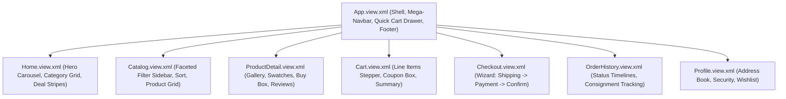

# Frontend Architecture Blueprint: Dual Client Strategy
**Applications:** `shop-ui` (SAPUI5 Freestyle) & `admin-ui` (SAP Fiori Elements)  
**Protocol:** OData V4 (JSON Batching / Two-Way Binding / Draft Orchestration)  
**Version:** 1.0.0 (Production Blueprint)  

---

## 1. Dual-Frontend Architectural Strategy

To fulfill the diverging demands of public consumer commerce and operational backoffice enterprise governance, the platform implements a **Dual-Client Frontend Architecture**:

```mermaid
flowchart TB
    subgraph Users ["Target Personas"]
        U_CUST["Consumer / Shopper"]
        U_STAFF["Operations / Merchant / Admin"]
    end

    subgraph Frontends ["SAP BTP Managed Approuter"]
        direction LR
        SHOP["shop-ui<br/>(SAPUI5 Freestyle)"]
        ADMIN["admin-ui<br/>(SAP Fiori Elements)"]
    end

    subgraph OData ["OData V4 Gateway Layer"]
        SRV_CAT["CatalogService"]
        SRV_CART["CartService"]
        SRV_ORD["OrderService"]
        SRV_ADM["AdminService"]
        SRV_INV["InventoryService"]
    end

    U_CUST -->|B2C Shopping Experience| SHOP
    U_STAFF -->|Operations & Management| ADMIN

    SHOP -->|OData V4 ($batch / $auto)| SRV_CAT
    SHOP -->|OData V4 ($direct)| SRV_CART
    SHOP -->|OData V4 ($direct)| SRV_ORD

    ADMIN -->|OData V4 Drafts| SRV_ADM
    ADMIN -->|OData V4 Analytics| SRV_INV
```

### Strategic Rationale
1. **`shop-ui` (SAPUI5 Freestyle):**
   - **User Experience:** Consumer e-commerce demands distinctive layout freedom, fluid micro-interactions, responsive image carousels, instant sticky cart drawers, variant swatches, and high-conversion checkout wizards.
   - **Technology:** SAPUI5 Freestyle (v1.120+) leveraging XML Views, custom CSS variables aligned with the SAP Horizon theme (`sap_horizon`), responsive grid layouts (`sap.ui.layout.cssgrid`), and custom JavaScript formatters.
2. **`admin-ui` (SAP Fiori Elements for OData V4):**
   - **Operational Governance:** Backoffice operators, warehouse managers, and merchant sellers require rapid data entry, standardized table filtering, analytical KPI cards, audit trails, and multi-step draft approvals.
   - **Technology:** SAP Fiori Elements floorplans (List Report, Object Page, Overview Page) driven entirely by metadata annotations (`@UI.*`, `@Common.*`), slashing frontend maintenance while guaranteeing 100% compliance with SAP Fiori design standards.

---

## 2. Customer Storefront (`shop-ui`): SAPUI5 Freestyle

### 2.1. Component & View Hierarchy
The customer storefront application is organized into a single-page application (SPA) routed via `sap.m.routing.Router`:



### 2.2. Key Views & Interactive Capabilities

#### 1. Global Shell & Navigation (`App.view.xml`)
- **Amazon-Style Mega Header:**
  - Marketplace branding logo.
  - Deliver-to postal code selector (updates localized shipping availability).
  - Central search bar with embedded category dropdown selector and instant auto-complete suggestions.
  - Language and currency switcher.
  - Account & Lists menu popover.
  - Cart button displaying real-time floating badge bound to `/ActiveCart/items/$count`.
- **Category Ribbon (`sap.m.OverflowToolbar`):** Instant top-level category triggers with horizontal scroll on mobile devices.
- **Quick Cart Drawer (`sap.m.ResponsivePopover` or Side Drawer):** Slides in from the right upon clicking "Add to Cart", displaying line item thumbnail, updated subtotal, and direct "Proceed to Checkout" button without leaving the product page.

#### 2. Product Discovery & Faceted Filtering (`Catalog.view.xml`)
- **Left Filter Rail (`sap.ui.layout.form.SimpleForm` & `sap.m.List`):**
  - Category tree hierarchy with breadcrumbs.
  - Multi-select facet checkboxes: Brand, Seller, Condition (New, Refurbished).
  - Price range slider (`sap.m.RangeSlider`) with min/max numeric inputs.
  - Customer review filter (4 stars & up, 3 stars & up).
- **Product Results Grid (`sap.f.GridList` / `sap.ui.layout.cssgrid.CSSGrid`):**
  - Product card containing hero image with smooth hover zoom.
  - Discount ribbon badge ("Save 20%").
  - Title, star rating with review count link.
  - Dynamic price display (Current price in bold, MSRP strikethrough).
  - Seller "Buy Box" badge ("Sold by: Official Store").
  - Quick "Add to Cart" action with instant feedback.

#### 3. High-Conversion Product Detail Page (`ProductDetail.view.xml`)
- **Media Showcase (Left Pane):** Multi-angle thumbnail strip bound to `ProductImages`; main high-resolution image with viewport magnifying loupe; video player integration.
- **Product Specs & Variant Matrix (Middle Pane):**
  - Title, Brand link, verified customer review rating summary.
  - Interactive variant selectors: Color swatches (rendered as custom round button groups) and Size/Storage chips (`sap.m.SegmentedButton`).
  - Bulleted key feature highlights and expandable rich markdown description.
- **The "Buy Box" Card (Right Sticky Pane):**
  - Real-time stock status indicator: "In Stock" (green), "Only 3 left in stock - order soon" (orange), or "Out of Stock" (red).
  - Fulfilling merchant name and seller reputation rating.
  - Quantity selector stepper (`sap.m.StepInput`, range 1..10).
  - Dual Primary Action Buttons:
    1. `Add to Cart` (yellow gradient button $\rightarrow$ updates cart and opens mini-cart drawer).
    2. `Buy Now` (orange gradient button $\rightarrow$ navigates directly to Step 3 of Checkout Wizard).
  - Add to Wishlist link button (`sap.m.Button` with icon `sap-icon://favorite`).
- **Other Sellers on Amazon Table:** Accordion section comparing alternative seller offers for this SKU sorted by total price + shipping speed.
- **Customer Reviews & Social Proof Section:**
  - Customer rating distribution histogram (5-star down to 1-star percentage bars).
  - Verified purchase review cards with helpfulness voting button.
  - "Write a Customer Review" modal dialog (`submitReview` action).

#### 4. Multi-Step Checkout Wizard (`Checkout.view.xml`)
Built utilizing `sap.m.Wizard` with linear step validation:
- **Step 1: Shipping Destination:**
  - Address radio group displaying saved addresses with default selected.
  - "Add New Address" inline dialog with postal code lookup and country dropdown.
- **Step 2: Delivery & Shipping Options:**
  - Standard Delivery (3-5 days, Free), Express Delivery (1-2 days, $9.99), Next-Day Priority ($19.99).
  - Delivery instructions memo field.
- **Step 3: Payment Method:**
  - Radio options: Credit/Debit Card, PayPal, Apple Pay, Invoice.
  - PCI-DSS compliant credit card input form (Tokenized client-side; raw numbers never touch CAP).
  - Billing address toggle ("Same as shipping address" or select custom).
- **Step 4: Review Items and Place Order:**
  - Order breakdown: Items subtotal, shipping cost, coupon discount deduction, sales tax, order grand total.
  - Primary Action: `Place Your Order` (`OrderService.checkout` OData V4 action).

### 2.3. Storefront State Management & OData V4 Models
- **Default OData V4 Model (`""`):** Bound to `CatalogService` for browsing (`$auto` batch group, read-only caching).
- **Named OData V4 Model (`cartModel`):** Bound to `CartService` using `$direct` update group to guarantee immediate server synchronization on cart mutations.
- **Named OData V4 Model (`orderModel`):** Bound to `OrderService` for checkout and order history.
- **Local Client UI Model (`ui` - `sap.ui.model.json.JSONModel`):** Manages non-persisted client states:
  ```json
  {
    "busy": false,
    "cartDrawerOpen": false,
    "selectedVariantId": null,
    "activeSearchQuery": "",
    "selectedFilters": {
      "categories": [],
      "brands": [],
      "minPrice": 0,
      "maxPrice": 1000,
      "minRating": 0
    }
  }
  ```

### 2.4. Project Directory Layout (`app/shop-ui`)
```text
app/shop-ui/
├── webapp/
│   ├── Component.js                # Root Component descriptor & routing init
│   ├── manifest.json               # App descriptor, data sources, routing targets
│   ├── index.html                  # Local standalone HTML bootstrap
│   ├── css/
│   │   └── style.css               # Amazon-style custom styles & theme overrides
│   ├── controller/
│   │   ├── App.controller.js       # Shell header, search dispatch, cart drawer
│   │   ├── Home.controller.js      # Homepage carousel & product rails
│   │   ├── Catalog.controller.js   # Filter engine & search execution
│   │   ├── ProductDetail.controller.js # Variant switcher, buy box, reviews
│   │   ├── Cart.controller.js      # Quantity management, coupon application
│   │   ├── Checkout.controller.js  # Wizard step progression & checkout action
│   │   └── OrderHistory.controller.js # Order tracking timeline
│   ├── view/
│   │   ├── App.view.xml
│   │   ├── Home.view.xml
│   │   ├── Catalog.view.xml
│   │   ├── ProductDetail.view.xml
│   │   ├── Cart.view.xml
│   │   ├── Checkout.view.xml
│   │   └── OrderHistory.view.xml
│   ├── model/
│   │   ├── formatter.js            # Currency, rating stars, date formatters
│   │   └── models.js               # Device and local UI model factories
│   └── i18n/
│       ├── i18n.properties         # Master English texts
│       └── i18n_de.properties      # German localization
├── ui5.yaml                        # UI5 Tooling server & proxy configuration
└── package.json                    # UI scripts & dependencies
```

---

## 3. Backoffice & Operations Hub (`admin-ui`): SAP Fiori Elements

### 3.1. Floorplan Architecture
The `admin-ui` application is built with **SAP Fiori Elements for OData V4**, using pre-configured floorplans:

| Floorplan | Business Scope | CDS Target Entity | Key Capabilities |
| :--- | :--- | :--- | :--- |
| **Overview Page (OVP)** | Operations Dashboard | Multi-entity analytical | KPI cards (GMV, Low Stock alerts, Unfulfilled orders), recent reviews, quick actions. |
| **List Report Object Page (LROP)** | Master Catalog Management | `AdminService.Products` | Draft editing (`@odata.draft.enabled`), variant matrix grid, image upload, categorization. |
| **List Report Object Page (LROP)** | Order Management & Fulfillment | `AdminService.Orders` | Order lifecycle monitoring, `fulfillShipment` action, line item status tracking. |
| **List Report Object Page (LROP)** | Inventory & Warehouse Control | `AdminService.Inventories` | Real-time stock counts across warehouses, replenishment triggers, reservation audit. |
| **List Report Object Page (LROP)** | Promotions & Coupon Engine | `AdminService.Promotions` | Discount scheduling, campaign management, coupon code generation. |

### 3.2. Annotations-Driven UI Design (CDS UI Annotations)

The entire user interface layout, filter bars, table columns, object page headers, and action buttons in `admin-ui` are declared directly in CDS annotations (e.g., `srv/admin-ui-annotations.cds`):

```cds
using { AdminService } from './admin-service';

/* -------------------------------------------------------------
 * PRODUCT MASTER LIST REPORT & OBJECT PAGE ANNOTATIONS
 * ------------------------------------------------------------- */
annotate AdminService.Products with @(
    UI.HeaderInfo: {
        TypeName:       '{i18n>Product}',
        TypeNamePlural: '{i18n>Products}',
        Title:          { $Type: 'UI.DataField', Value: title },
        Description:    { $Type: 'UI.DataField', Value: brand }
    },
    UI.SelectionFields: [
        category_ID,
        brand,
        status
    ],
    UI.LineItem: [
        { $Type: 'UI.DataField', Value: sku, Label: '{i18n>SKU}' },
        { $Type: 'UI.DataField', Value: title, Label: '{i18n>Title}' },
        { $Type: 'UI.DataField', Value: brand, Label: '{i18n>Brand}' },
        { $Type: 'UI.DataField', Value: category.name, Label: '{i18n>Category}' },
        { $Type: 'UI.DataField', Value: averageRating, Label: '{i18n>Rating}' },
        { 
            $Type: 'UI.DataField', 
            Value: status, 
            Criticality: (status = 'ACTIVE' ? 3 : status = 'DRAFT' ? 2 : 1),
            Label: '{i18n>Status}' 
        },
        { $Type: 'UI.DataField', Value: isFeatured, Label: '{i18n>Featured}' }
    ],
    UI.Facets: [
        {
            $Type:  'UI.CollectionFacet',
            ID:     'GeneralInfo',
            Label:  '{i18n>GeneralInformation}',
            Facets: [
                { $Type: 'UI.ReferenceFacet', Target: '@UI.FieldGroup#Details', Label: '{i18n>Details}' },
                { $Type: 'UI.ReferenceFacet', Target: '@UI.FieldGroup#Metrics', Label: '{i18n>Metrics}' }
            ]
        },
        {
            $Type:  'UI.ReferenceFacet',
            Target: 'variants/@UI.LineItem',
            Label:  '{i18n>ProductVariants}'
        },
        {
            $Type:  'UI.ReferenceFacet',
            Target: 'images/@UI.LineItem',
            Label:  '{i18n>MediaGallery}'
        }
    ],
    UI.FieldGroup #Details: {
        Data: [
            { $Type: 'UI.DataField', Value: sku },
            { $Type: 'UI.DataField', Value: brand },
            { $Type: 'UI.DataField', Value: title },
            { $Type: 'UI.DataField', Value: category_ID },
            { $Type: 'UI.DataField', Value: description }
        ]
    },
    UI.FieldGroup #Metrics: {
        Data: [
            { $Type: 'UI.DataField', Value: averageRating },
            { $Type: 'UI.DataField', Value: reviewCount },
            { $Type: 'UI.DataField', Value: status }
        ]
    }
);

/* -------------------------------------------------------------
 * ORDER FULFILLMENT ACTIONS IN LIST REPORT
 * ------------------------------------------------------------- */
annotate AdminService.Orders with @(
    UI.LineItem: [
        { $Type: 'UI.DataField', Value: orderNumber },
        { $Type: 'UI.DataField', Value: customer.firstName },
        { $Type: 'UI.DataField', Value: totalAmount },
        { $Type: 'UI.DataField', Value: status },
        { $Type: 'UI.DataField', Value: paymentStatus },
        { $Type: 'UI.DataField', Value: fulfillmentStatus },
        {
            $Type:  'UI.DataFieldForAction',
            Action: 'AdminService.fulfillShipment',
            Label:  '{i18n>FulfillAndShip}'
        }
    ]
);
```

### 3.3. Draft Handling & Concurrency Control
- Products, Variants, Categories, and Promotions are annotated with `@odata.draft.enabled`.
- Allows administrators and sellers to create or edit products in draft state across multiple browser sessions without locking other records.
- CAP automatically manages draft persistence tables (`AdminService.Products.drafts`).
- When the user selects **Save** on the Fiori Object Page, CAP validates all invariants, verifies uniqueness constraints, and atomically activates the draft into the production table.

### 3.4. Project Directory Layout (`app/admin-ui`)
```text
app/admin-ui/
├── webapp/
│   ├── Component.js
│   ├── manifest.json               # Fiori Elements template definitions
│   ├── index.html
│   └── i18n/
│       ├── i18n.properties         # Master backoffice labels
│       └── i18n_de.properties
├── ui5.yaml
└── package.json
```

---

## 4. UI Theming, Responsive Design & Accessibility

- **Design System:** Standardized on the latest **SAP Horizon** design system (`sap_horizon` light and `sap_horizon_dark`), delivering clean shadows, high visual contrast, rounded corners, and clear typographic hierarchy.
- **Form Factors:** Both `shop-ui` and `admin-ui` support full responsiveness across Desktop (1920x1080), Tablet (iPad 1024x768), and Mobile (iPhone/Android 390x844).
- **Accessibility:** Built according to **WCAG 2.1 Level AA** standards with ARIA live regions for cart updates, full keyboard navigation support, high color contrast ratios ($\ge 4.5:1$), and screen-reader accessibility labels on all interactive icons.
