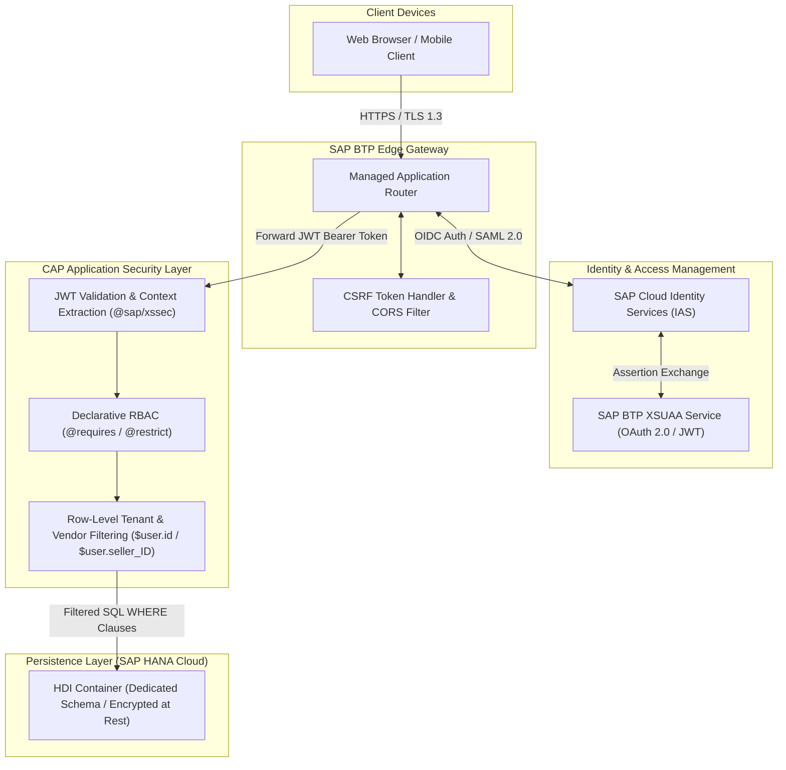
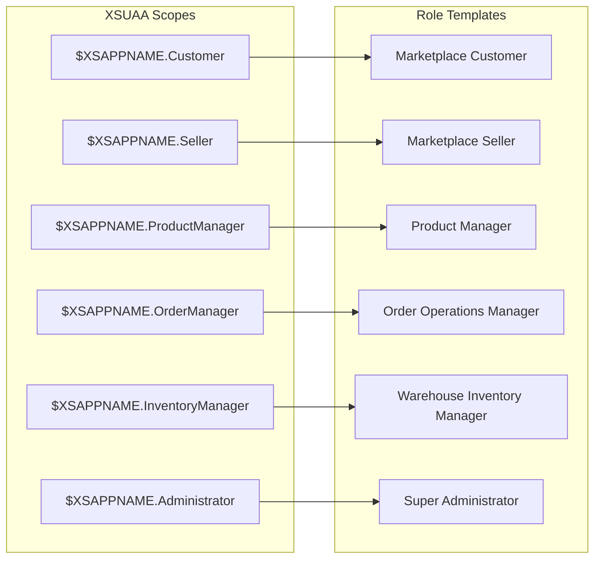

# Security Architecture & Authorization Blueprint
**Platform:** SAP BTP XSUAA, SAP Cloud Identity Services & SAP CAP Access Control  
**Specification:** Identity, RBAC, Scopes, Multi-Vendor Row-Level Security & Compliance  
**Version:** 1.0.0 (Production Blueprint)  

---

## 1. Security Architecture Overview

The marketplace security architecture implements a **Zero-Trust, Defense-in-Depth** model across the application stack. All incoming requests pass through edge API gateways with transport-layer security (TLS 1.3), automated CSRF token management, and OAuth 2.0 / OIDC authentication via **SAP BTP XSUAA**. Business logic layers enforce declarative and programmatic **Row-Level Access Control (RLS)** in Core Data Services (CDS).



---

## 2. Authorization Roles & Scopes Hierarchy

The platform defines six core business authorization roles with dedicated scopes configured in `xs-security.json`:



### 2.1. Role Definitions & Permissions Matrix

| Role | Scope | Key Permissions & Responsibilities |
| :--- | :--- | :--- |
| **`Customer`** | `$XSAPPNAME.Customer` | Manage self profile, address book, active cart, and wishlists. Execute checkout, submit reviews, and track personal orders. **No access to backoffice.** |
| **`Seller`** | `$XSAPPNAME.Seller` | Vendor organization. Onboard and update seller product offers, view sales performance, and manage designated warehouse fulfillment consignments. **Restricted to self vendor data.** |
| **`ProductManager`**| `$XSAPPNAME.ProductManager` | Global catalog curator. Create, edit, and discontinue master Products, Categories, and Variants. Moderate customer reviews. Manage marketing promotions. |
| **`OrderManager`** | `$XSAPPNAME.OrderManager` | Customer support & fulfillment lead. View all customer orders, process manual order adjustments, initiate returns, trigger refunds, and manage disputes. |
| **`InventoryManager`**| `$XSAPPNAME.InventoryManager`| Logistics director. Maintain warehouse master records, track physical stock bins, execute stock adjustments, manage replenishment thresholds. |
| **`Administrator`** | `$XSAPPNAME.Administrator` | Platform superuser. Complete governance across system settings, seller onboarding approvals, role assignments, financial audit records, and security logs. |

---

## 3. Service & Entity Authorization Matrix

The table below defines the authorization criteria across all CAP domain services:

| Service / Action | Public / Anonymous | Customer | Seller | ProductManager | OrderManager | InventoryManager | Administrator |
| :--- | :---: | :---: | :---: | :---: | :---: | :---: | :---: |
| **`CatalogService` (Read Products/Categories)** | Read | Read | Read | Read | Read | Read | Read |
| **`CatalogService.submitReview`** | ❌ | Execute | ❌ | ❌ | ❌ | ❌ | Execute |
| **`CustomerService`** | ❌ | Own Data (`$user.id`) | ❌ | ❌ | ❌ | ❌ | Read (Audit) |
| **`CartService` (ActiveCart, Items)** | Session Guest | Own Data (`$user.id`) | ❌ | ❌ | ❌ | ❌ | Read |
| **`CartService.applyCoupon`** | ❌ | Execute | ❌ | ❌ | ❌ | ❌ | Execute |
| **`OrderService.checkout`** | ❌ | Execute | ❌ | ❌ | ❌ | ❌ | ❌ |
| **`OrderService.cancelOrder`** | ❌ | Own Pending | ❌ | ❌ | Execute | ❌ | Execute |
| **`OrderService.returnOrder`** | ❌ | Own Delivered| ❌ | ❌ | Execute | ❌ | Execute |
| **`PaymentService.createPayment`** | ❌ | Execute | ❌ | ❌ | ❌ | ❌ | ❌ |
| **`InventoryService`** | ❌ | ❌ | ❌ | ❌ | ❌ | Read / Write | Full |
| **`AdminService.Products` (Draft)** | ❌ | ❌ | ❌ | Read / Write | Read | Read | Full |
| **`AdminService.ProductOffers`** | ❌ | ❌ | Own Vendor | Read | Read | Read | Full |
| **`AdminService.fulfillShipment`**| ❌ | ❌ | Own Consignment | ❌ | Execute | Execute | Execute |
| **`AdminService.Promotions`** | ❌ | ❌ | ❌ | Read / Write | Read | ❌ | Full |
| **`AdminService.approveSeller`** | ❌ | ❌ | ❌ | ❌ | ❌ | ❌ | Execute |

---

## 4. CDS Row-Level Security & Access Control Annotations

CAP provides native multi-tenant and multi-role enforcement using `@restrict` and `@requires` annotations directly on services and entities.

### 4.1. Row-Level Data Isolation for Customers
Ensures customers can only read and mutate their own profile, cart, wishlists, and orders:

```cds
using { sap.marketplace as mp } from '../db/schema';

// Customer Service Restrictions
annotate mp.Customer with @(
    restrict: [
        { grant: ['READ', 'UPDATE'], to: 'Customer', where: 'externalUserId = $user.id' },
        { grant: '*', to: 'Administrator' }
    ]
);

annotate mp.Cart with @(
    restrict: [
        { grant: '*', to: 'Customer', where: 'customer.externalUserId = $user.id' }
    ]
);

annotate mp.Order with @(
    restrict: [
        { grant: ['READ', 'UPDATE'], to: 'Customer', where: 'customer.externalUserId = $user.id' },
        { grant: '*', to: ['OrderManager', 'Administrator'] }
    ]
);
```

### 4.2. Multi-Vendor Row-Level Security for 3rd-Party Sellers
Enforces multi-vendor isolation so that Sellers can only view, create, or update offers and inventory belonging strictly to their registered merchant entity (`$user.seller_ID` attribute passed in the XSUAA JWT token):

```cds
// Seller Offer Restrictions
annotate mp.ProductOffer with @(
    restrict: [
        { grant: 'READ', to: 'any' }, // Public price viewing
        { grant: ['INSERT', 'UPDATE', 'DELETE'], to: 'Seller', where: 'seller.externalSellerId = $user.seller_ID' },
        { grant: '*', to: ['ProductManager', 'Administrator'] }
    ]
);

// Seller Order Items Restrictions (Seller only sees lines they fulfill)
annotate mp.OrderItem with @(
    restrict: [
        { grant: 'READ', to: 'Customer', where: 'order.customer.externalUserId = $user.id' },
        { grant: ['READ', 'UPDATE'], to: 'Seller', where: 'seller.externalSellerId = $user.seller_ID' },
        { grant: '*', to: ['OrderManager', 'Administrator'] }
    ]
);
```

### 4.3. Backoffice Role-Based Restrictions
Secures administrative endpoints:

```cds
// Admin Service Global Restriction
annotate AdminService with @(requires: ['Seller', 'ProductManager', 'OrderManager', 'InventoryManager', 'Administrator']);

annotate AdminService.Categories with @(
    restrict: [
        { grant: '*', to: ['ProductManager', 'Administrator'] },
        { grant: 'READ', to: ['Seller', 'OrderManager', 'InventoryManager'] }
    ]
);

annotate AdminService.Sellers with @(
    restrict: [
        { grant: ['READ', 'UPDATE'], to: 'Seller', where: 'externalSellerId = $user.seller_ID' },
        { grant: '*', to: 'Administrator' }
    ]
);
```

---

## 5. XSUAA Configuration (`xs-security.json`)

Below is the production security descriptor configuring OAuth2 scopes, role templates, and user attribute mappings:

```json
{
  "xsappname": "amazon-marketplace",
  "tenant-mode": "shared",
  "description": "Security descriptor for Enterprise E-Commerce Marketplace",
  "scopes": [
    {
      "name": "$XSAPPNAME.Customer",
      "description": "E-Commerce Customer Storefront Access"
    },
    {
      "name": "$XSAPPNAME.Seller",
      "description": "3rd-Party Merchant Portal Access"
    },
    {
      "name": "$XSAPPNAME.ProductManager",
      "description": "Product Catalog & Category Maintenance"
    },
    {
      "name": "$XSAPPNAME.OrderManager",
      "description": "Order Lifecycle, Returns & Dispute Operations"
    },
    {
      "name": "$XSAPPNAME.InventoryManager",
      "description": "Warehouse Stock & Logistics Maintenance"
    },
    {
      "name": "$XSAPPNAME.Administrator",
      "description": "Full Platform Superuser Governance"
    }
  ],
  "attributes": [
    {
      "name": "seller_ID",
      "description": "Assigned Seller Organization ID",
      "valueType": "string"
    }
  ],
  "role-templates": [
    {
      "name": "CustomerRole",
      "description": "Customer standard access",
      "scope-references": ["$XSAPPNAME.Customer"]
    },
    {
      "name": "SellerRole",
      "description": "Seller vendor management",
      "scope-references": ["$XSAPPNAME.Seller"],
      "attribute-references": ["seller_ID"]
    },
    {
      "name": "ProductManagerRole",
      "description": "Catalog curation and pricing",
      "scope-references": ["$XSAPPNAME.ProductManager"]
    },
    {
      "name": "OrderManagerRole",
      "description": "Order fulfillment and dispute handling",
      "scope-references": ["$XSAPPNAME.OrderManager"]
    },
    {
      "name": "InventoryManagerRole",
      "description": "Warehouse inventory management",
      "scope-references": ["$XSAPPNAME.InventoryManager"]
    },
    {
      "name": "AdministratorRole",
      "description": "Super administrator privileges",
      "scope-references": ["$XSAPPNAME.Administrator"]
    }
  ],
  "role-collections": [
    {
      "name": "Marketplace_Customer",
      "description": "Customer Portal User",
      "role-template-references": ["$XSAPPNAME.CustomerRole"]
    },
    {
      "name": "Marketplace_Seller",
      "description": "Merchant Operations User",
      "role-template-references": ["$XSAPPNAME.SellerRole"]
    },
    {
      "name": "Marketplace_Operations",
      "description": "Catalog, Order & Inventory Staff",
      "role-template-references": [
        "$XSAPPNAME.ProductManagerRole",
        "$XSAPPNAME.OrderManagerRole",
        "$XSAPPNAME.InventoryManagerRole"
      ]
    },
    {
      "name": "Marketplace_SuperAdmin",
      "description": "Platform Super Administrator",
      "role-template-references": ["$XSAPPNAME.AdministratorRole"]
    }
  ],
  "oauth2-configuration": {
    "token-validity": 3600,
    "refresh-token-validity": 86400,
    "redirect-uris": [
      "https://*.cfapps.*.hana.ondemand.com/**"
    ]
  }
}
```

---

## 6. Data Privacy, Compliance & API Hardening

### 6.1. GDPR & Data Privacy (Personal Identifiable Information)
- **PII Segregation:** `Customer` details (names, emails, phone numbers) and `Address` records are flagged with SAP Personal Data annotations (`@PersonalData.IsPotentiallyPersonal: true`).
- **Data Erasure (Right to be Forgotten):** When a customer requests account deletion, a dedicated sanitization routine scrubs name, email, and phone numbers (`status = 'DELETED'`, email set to anonymized hash `deleted_<UUID>@anonymized.local`), while retaining financial transaction records in an anonymized state to satisfy statutory tax retention mandates.
- **Audit Logging:** All write and update operations on critical financial entities (`Payment`, `Order`, `OrderStatusHistory`) automatically record user context via the CAP `managed` aspect (`createdBy`, `createdAt`, `modifiedBy`, `modifiedAt`).

### 6.2. PCI-DSS Compliance (Zero Cardholder Data Architecture)
- The platform never receives, transmits, or stores Primary Account Numbers (PAN), CVV/CVC codes, or PIN blocks in application memory or in the SAP HANA database.
- Payment inputs in `shop-ui` are handled via client-side hosted fields / iframes provided directly by the payment provider (Stripe / Adyen / PayPal Mock), which return an ephemeral `paymentToken`.
- The CAP `PaymentService` only handles the token and gateway transaction reference ID (`transactionReference`).

### 6.3. API Edge Hardening & CSRF Protection
- **CSRF Token Handshake:** Enforced at the SAP BTP Managed Approuter layer. All non-GET OData V4 operations (`POST`, `PUT`, `PATCH`, `DELETE`) require a valid `X-CSRF-Token` header retrieved via `GET /odata/v4/catalog` with `X-CSRF-Token: Fetch`.
- **Content Security Policy (CSP):** Strict CSP headers configured in Approuter preventing Cross-Site Scripting (XSS):
  ```text
  default-src 'self'; script-src 'self' https://sapui5.hana.ondemand.com; style-src 'self' 'unsafe-inline' https://sapui5.hana.ondemand.com; img-src 'self' data: https: blob:; connect-src 'self' https:;
  ```
- **Clickjacking Protection:** All HTTP responses include `X-Frame-Options: SAMEORIGIN` and `X-Content-Type-Options: nosniff`.
- **SQL / CQL Injection Prevention:** All database operations execute strictly through the parameterized CAP Core Query Language (CQL), preventing raw string concatenation.
