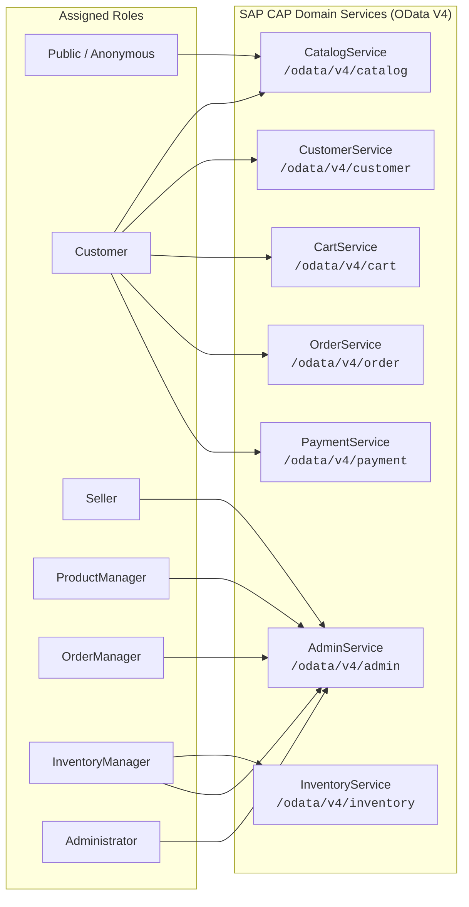

# Service Architecture & Business Operations Specification
**Platform:** SAP Cloud Application Programming Model (Node.js / OData V4)  
**Specification:** Domain Service Projections, Bound/Unbound Actions, Eventing & Logic  
**Version:** 1.0.0 (Production Blueprint)  

---

## 1. Service Layer Overview

The backend architecture implements seven business domain services, strictly adhering to Domain-Driven Design (DDD). All services expose standard **OData V4** protocols, supporting rich queries (`$expand`, `$select`, `$filter`, `$orderby`, `$search`), batching (`$batch`), optimistic concurrency (`@odata.etag`), and draft orchestration (`@odata.draft.enabled`).



---

## 2. Entity Exposure & Service Matrix

The following matrix defines the entity projections, accessibility, and projection capabilities across all seven services.

| Entity | `CatalogService` | `CustomerService` | `CartService` | `OrderService` | `PaymentService` | `InventoryService` | `AdminService` |
| :--- | :---: | :---: | :---: | :---: | :---: | :---: | :---: |
| **`Category`** | `@readonly` | — | — | — | — | — | Full (Draft) |
| **`Product`** | `@readonly` (FTS) | — | — | — | — | — | Full (Draft) |
| **`ProductVariant`** | `@readonly` | — | `@readonly` | `@readonly` | — | `@readonly` | Full (Draft) |
| **`ProductImage`** | `@readonly` | — | — | — | — | — | Full (Draft) |
| **`ProductOffer`** | `@readonly` (Active) | — | `@readonly` | `@readonly` | — | — | Restricted (Seller) |
| **`Seller`** | `@readonly` (Public profile) | — | — | — | — | — | Restricted / Full |
| **`Customer`** | — | Restricted (`$user.id`) | — | `@readonly` | — | — | Full (Admin) |
| **`Address`** | — | Full (`$user.id`) | — | `@readonly` | — | — | Full (Admin) |
| **`Cart`** | — | — | Full (`$user.id` / Guest) | — | — | — | Read-only |
| **`CartItem`** | — | — | Full | — | — | — | Read-only |
| **`Wishlist`** | — | Full (`$user.id`) | — | — | — | — | Read-only |
| **`WishlistItem`** | — | Full | — | — | — | — | Read-only |
| **`Order`** | — | — | — | Restricted (`$user.id`) | `@readonly` | — | Full (Role-based) |
| **`OrderItem`** | — | — | — | Restricted | — | — | Full (Role-based) |
| **`OrderStatusHistory`** | — | — | — | `@readonly` | — | — | Full |
| **`Payment`** | — | — | — | `@readonly` | Full | — | Full (Audited) |
| **`Shipment`** | — | — | — | `@readonly` | — | — | Full (Fulfillment) |
| **`Warehouse`** | — | — | — | — | — | Restricted (Manager) | Full |
| **`Inventory`** | — | — | — | — | — | Full (Manager) | Full |
| **`InventoryReservation`** | — | — | — | — | — | Full | Full |
| **`Review`** | `@readonly` (Approved) | Restricted | — | — | — | — | Full (Moderation) |
| **`ReviewVote`** | — | Restricted | — | — | — | — | Full |
| **`Promotion`** | `@readonly` (Active) | — | — | — | — | — | Full (Draft) |
| **`Coupon`** | — | — | `@readonly` (Validation) | — | — | — | Full (Draft) |
| **`CouponUsage`** | — | — | — | Insert-only | — | — | Full |
| **`Notification`** | — | Restricted (`$user.id`) | — | — | — | — | Full |

---

## 3. Comprehensive Business Actions & Functions Specification

### 3.1. Shopping Cart & Promotional Actions (`CartService`)

#### Action: `addToCart`
- **Definition:** `action addToCart(offer_ID: UUID, quantity: Integer) returns Cart;`
- **Binding:** Bound to `Cart` or unbound passing session identity.
- **Service:** `CartService`
- **Authorized Roles:** `Customer`, Anonymous (Guest Session Token).
- **Execution Flow & Invariants:**
  1. Retrieve active `Cart` for `$user.id` or session token. If none exists, instantiate new `Cart`.
  2. Verify that `ProductOffer` exists, is active (`isActive = true`), and that the linked `ProductVariant` is active.
  3. Query `InventoryService` to ensure available stock (`quantityOnHand - quantityReserved >= quantity`).
  4. If the item already exists in `CartItem`, increment quantity (enforcing maximum purchase limit per SKU, e.g., max 10).
  5. Snapshot the latest `unitPrice` from `ProductOffer.price` and recalculate `extendedPrice`.
  6. Recalculate cart totals: `subtotalAmount`, apply active coupon if present, recompute `taxEstimate` and `totalAmount`.
  7. Return complete expanded `Cart` structure with items.

#### Action: `removeFromCart`
- **Definition:** `action removeFromCart(cartItem_ID: UUID) returns Cart;`
- **Binding:** Unbound in `CartService`.
- **Authorized Roles:** `Customer`, Anonymous.
- **Execution Flow & Invariants:**
  1. Verify `cartItem_ID` belongs to the requesting customer's cart (`Cart.customer = $user.id`).
  2. Delete targeted `CartItem`.
  3. Trigger cart totals recalculation (subtotal, shipping, discount, total).
  4. Return updated `Cart`.

#### Action: `updateCartQuantity`
- **Definition:** `action updateCartQuantity(cartItem_ID: UUID, quantity: Integer) returns Cart;`
- **Binding:** Unbound in `CartService`.
- **Authorized Roles:** `Customer`, Anonymous.
- **Execution Flow & Invariants:**
  1. Validate `quantity >= 1` (if `quantity = 0`, delegate to `removeFromCart`).
  2. Verify stock availability for requested delta quantity.
  3. Update `CartItem.quantity` and `CartItem.extendedPrice`.
  4. Recalculate cart totals and return updated `Cart`.

#### Action: `applyCoupon`
- **Definition:** `action applyCoupon(couponCode: String) returns Cart;`
- **Binding:** Unbound in `CartService`.
- **Authorized Roles:** `Customer`.
- **Execution Flow & Invariants:**
  1. Search for active `Coupon` matching `couponCode` (`isActive = true`).
  2. Check coupon validity window (`Promotion.startDate <= now() <= Promotion.endDate`).
  3. Check global redemption ceiling (`currentRedemptions < maxRedemptions`).
  4. Query `CouponUsage` for current customer to ensure `perUserLimit` is not exceeded.
  5. Check minimum cart order value (`Cart.subtotalAmount >= Promotion.minOrderValue`).
  6. Compute discount:
     - If `PERCENTAGE`: `discount = subtotalAmount * (discountValue / 100)`
     - If `FIXED_AMOUNT`: `discount = min(discountValue, subtotalAmount)`
  7. Update `Cart.appliedCoupon_ID`, `Cart.discountAmount`, and `Cart.totalAmount`.
  8. Return updated `Cart` or reject with clear business error.

---

### 3.2. Order Placement & Lifecycle Actions (`OrderService`)

#### Action: `checkout`
- **Definition:**
  ```cds
  action checkout(
      shippingAddress_ID : UUID,
      billingAddress_ID  : UUID,
      paymentMethod      : String
  ) returns {
      order_ID    : UUID;
      orderNumber : String;
      totalAmount : Decimal(15,2);
      currency    : String;
  };
  ```
- **Service:** `OrderService`
- **Authorized Roles:** `Customer`.
- **Execution Flow & Invariants:**
  1. Validate requesting customer identity and load active `Cart`. Reject if cart has zero items.
  2. Validate ownership of `shippingAddress_ID` and `billingAddress_ID`.
  3. **Atomic Stock Reservation:** Invoke internal `InventoryService.reserveInventory` passing cart items. If any item fails reservation, abort transaction and return descriptive conflict error (`409 Conflict`).
  4. Generate sequential human-readable `orderNumber` (e.g., `ORD-YYYYMMDD-XXXXX`).
  5. Insert new `Order` aggregate with status `PENDING_PAYMENT` and `paymentStatus = 'UNPAID'`.
  6. Insert `OrderItem` lines copying current snapshot prices, descriptions, and seller references.
  7. If coupon was applied, create `CouponUsage` record and increment `Coupon.currentRedemptions`.
  8. Clear items from the customer's active `Cart`.
  9. Record initial entry in `OrderStatusHistory` (`oldStatus = null, newStatus = 'PENDING_PAYMENT'`).
  10. Return order summary and transaction identifiers for payment initiation.

#### Action: `cancelOrder`
- **Definition:** `action cancelOrder(order_ID: UUID, reason: String) returns Order;`
- **Service:** `OrderService`
- **Authorized Roles:** `Customer` (for self orders), `OrderManager`, `Administrator`.
- **Execution Flow & Invariants:**
  1. Verify order exists and belongs to the customer.
  2. Invariant: Order status must be `PENDING_PAYMENT` or `CONFIRMED`. If already `PROCESSING` or `SHIPPED`, reject with: "Order is already being prepared or dispatched and cannot be cancelled directly. Please initiate a return."
  3. Mutate order status: `status = 'CANCELLED'`.
  4. Invoke `InventoryService.releaseInventory` for all reserved stock associated with the order.
  5. If payment was already captured (`paymentStatus = 'PAID'`), trigger `PaymentService.createRefund`.
  6. Write audit log to `OrderStatusHistory`.
  7. Emit domain event: `marketplace/order/cancelled`.

#### Action: `returnOrder`
- **Definition:**
  ```cds
  action returnOrder(
      order_ID : UUID,
      items    : array of { orderItem_ID : UUID; quantity : Integer; reason : String; }
  ) returns Order;
  ```
- **Service:** `OrderService`
- **Authorized Roles:** `Customer`, `OrderManager`.
- **Execution Flow & Invariants:**
  1. Invariant: Order status must be `DELIVERED` and delivery date within return policy window (e.g., within 30 days).
  2. Verify requested items and quantities do not exceed original line item quantities.
  3. Update targeted `OrderItem.status = 'RETURNED'`.
  4. If all items returned, update `Order.status = 'RETURNED'`.
  5. Generate RMA (Return Merchandise Authorization) number and reverse logistics shipment record.
  6. Emit event: `marketplace/order/returned`.

---

### 3.3. Payment Orchestration Actions (`PaymentService`)

#### Action: `createPayment`
- **Definition:**
  ```cds
  action createPayment(
      order_ID        : UUID,
      paymentProvider : String,
      paymentToken    : String
  ) returns {
      payment_ID           : UUID;
      status               : String;
      transactionReference : String;
  };
  ```
- **Service:** `PaymentService`
- **Authorized Roles:** `Customer`.
- **Execution Flow & Invariants:**
  1. Retrieve `Order` by `order_ID`. Ensure status is `PENDING_PAYMENT`.
  2. Forward token to payment provider gateway (Mock / Stripe / Adyen / PayPal).
  3. Handle response:
     - **Success:**
       - Create `Payment` record with status `CAPTURED`.
       - Update `Order.status = 'CONFIRMED'`, `Order.paymentStatus = 'PAID'`.
       - Trigger `InventoryService.confirmReservation` to finalize inventory deduction.
       - Emit event `marketplace/payment/captured`.
     - **Failure:**
       - Create `Payment` record with status `FAILED`.
       - Update `Order.paymentStatus = 'FAILED'`.
       - Trigger `InventoryService.releaseInventory` to unreserve locked stock.
       - Return error code and failure description.

---

### 3.4. Inventory & Warehouse Logistics Actions (`InventoryService`)

#### Action: `reserveInventory`
- **Definition:**
  ```cds
  action reserveInventory(
      order_ID : UUID,
      items    : array of { variant_ID : UUID; quantity : Integer; }
  ) returns array of UUID; // returns reservation IDs
  ```
- **Service:** `InventoryService`
- **Authorized Roles:** Internal Service call / `InventoryManager`.
- **Execution Flow & Invariants:**
  1. Open explicit serializable transaction on HANA (`SELECT ... FOR UPDATE`).
  2. For each requested variant:
     - Locate warehouse with sufficient `quantityOnHand - quantityReserved >= quantity`.
     - Update `quantityReserved = quantityReserved + quantity`.
     - Create `InventoryReservation` record with `status = 'RESERVED'` and `expiresAt = now() + 15 minutes`.
  3. If any item is unavailable, throw exception triggering automatic database rollback of prior holds in this transaction.
  4. Return generated reservation IDs.

#### Action: `releaseInventory`
- **Definition:** `action releaseInventory(reservation_ID: UUID, reason: String) returns Boolean;`
- **Service:** `InventoryService`
- **Authorized Roles:** Internal Service / `InventoryManager`.
- **Execution Flow & Invariants:**
  1. Retrieve `InventoryReservation` by ID. Ensure status is `RESERVED`.
  2. Locate linked `Inventory` record.
  3. Decrement `quantityReserved = quantityReserved - reservation.quantity`.
  4. Update reservation status to `RELEASED`.
  5. Return true.

---

### 3.5. Wishlist & Customer Engagement Actions (`CustomerService`)

#### Action: `addToWishlist`
- **Definition:** `action addToWishlist(product_ID: UUID, variant_ID: UUID) returns WishlistItem;`
- **Service:** `CustomerService`
- **Authorized Roles:** `Customer`.
- **Execution Flow & Invariants:**
  1. Locate or create customer's default `Wishlist`.
  2. Check if product variant is already present. If duplicate, return existing item without error.
  3. Insert new `WishlistItem` and return record.

#### Action: `removeFromWishlist`
- **Definition:** `action removeFromWishlist(wishlistItem_ID: UUID) returns Boolean;`
- **Service:** `CustomerService`
- **Authorized Roles:** `Customer`.
- **Execution Flow & Invariants:**
  1. Verify item belongs to customer's wishlist.
  2. Delete `WishlistItem` record and return true.

---

### 3.6. Social Proof & Product Review Actions (`CatalogService`)

#### Action: `submitReview`
- **Definition:**
  ```cds
  action submitReview(
      product_ID : UUID,
      rating     : Integer,
      headline   : String,
      comment    : String
  ) returns Review;
  ```
- **Service:** `CatalogService`
- **Authorized Roles:** `Customer`.
- **Execution Flow & Invariants:**
  1. Invariant: `rating` must be between 1 and 5.
  2. Check if customer has already reviewed this product. Prevent duplicate reviews per user/product pair.
  3. Query `Order` and `OrderItem` history: If customer purchased this product with status `DELIVERED`, set `isVerifiedPurchase = true`.
  4. Insert `Review` with status `APPROVED` (or `PENDING_MODERATION` if profanity filters trigger).
  5. Trigger asynchronous calculation of `Product.averageRating` and `Product.reviewCount`.
  6. Return newly created `Review`.

#### Action: `markReviewHelpful`
- **Definition:** `action markReviewHelpful(review_ID: UUID, isHelpful: Boolean) returns Integer;`
- **Service:** `CatalogService`
- **Authorized Roles:** `Customer`.
- **Execution Flow & Invariants:**
  1. Invariant: Customer cannot vote on their own review.
  2. Check if `ReviewVote` already exists for this `(review_ID, customer_ID)`.
  3. Insert or update `ReviewVote`.
  4. Recalculate and update `Review.helpfulVotes`.
  5. Return new aggregate helpful vote count.

---

## 4. CDS Service Definitions (Blueprints)

Below are the production CDS service definitions ready for deployment in `srv/`:

### 4.1. Catalog Service (`srv/catalog-service.cds`)
```cds
using { sap.marketplace as mp } from '../db/schema';

@path: '/odata/v4/catalog'
service CatalogService {
    @readonly
    entity Categories as projection on mp.Category {
        ID, code, name, description, level, displayOrder, imageUrl, parent,
        children : redirected to Categories
    } where isActive = true;

    @readonly
    entity Products as projection on mp.Product {
        ID, sku, brand, title, description, averageRating, reviewCount, isFeatured,
        category : redirected to Categories,
        variants : redirected to ProductVariants,
        images   : redirected to ProductImages,
        reviews  : redirected to Reviews
    } where status = 'ACTIVE';

    @readonly
    entity ProductVariants as projection on mp.ProductVariant {
        ID, variantSku, gtinEan, attributes, weightKg, dimensionsCm,
        product : redirected to Products,
        offers  : redirected to ProductOffers
    } where isActive = true;

    @readonly
    entity ProductImages as projection on mp.ProductImage;

    @readonly
    entity ProductOffers as projection on mp.ProductOffer {
        ID, price, currency, originalPrice, condition, leadTimeDays, isBuyBoxWinner,
        variant : redirected to ProductVariants,
        seller  : redirected to SellerProfiles
    } where isActive = true;

    @readonly
    entity SellerProfiles as projection on mp.Seller {
        ID, storeName, rating
    } where status = 'APPROVED';

    @readonly
    entity Reviews as projection on mp.Review {
        ID, rating, headline, comment, isVerifiedPurchase, helpfulVotes, createdAt,
        customer.firstName as authorName,
        product : redirected to Products
    } where status = 'APPROVED';

    // Actions
    action submitReview(product_ID: UUID, rating: Integer, headline: String, comment: String) returns Reviews;
    action markReviewHelpful(review_ID: UUID, isHelpful: Boolean) returns Integer;
}
```

### 4.2. Cart Service (`srv/cart-service.cds`)
```cds
using { sap.marketplace as mp } from '../db/schema';

@path: '/odata/v4/cart'
service CartService {
    entity ActiveCart as projection on mp.Cart;
    entity CartItems  as projection on mp.CartItem;

    action addToCart(offer_ID: UUID, quantity: Integer) returns ActiveCart;
    action removeFromCart(cartItem_ID: UUID) returns ActiveCart;
    action updateCartQuantity(cartItem_ID: UUID, quantity: Integer) returns ActiveCart;
    action applyCoupon(couponCode: String) returns ActiveCart;
    action clearCart() returns Boolean;
}
```

### 4.3. Order Service (`srv/order-service.cds`)
```cds
using { sap.marketplace as mp } from '../db/schema';

@path: '/odata/v4/order'
service OrderService {
    @readonly
    entity Orders as projection on mp.Order {
        *,
        items     : redirected to OrderItems,
        history   : redirected to OrderHistory,
        shipments : redirected to Shipments
    };

    @readonly
    entity OrderItems as projection on mp.OrderItem;

    @readonly
    entity OrderHistory as projection on mp.OrderStatusHistory;

    @readonly
    entity Shipments as projection on mp.Shipment;

    action checkout(
        shippingAddress_ID : UUID,
        billingAddress_ID  : UUID,
        paymentMethod      : String
    ) returns {
        order_ID    : UUID;
        orderNumber : String;
        totalAmount : Decimal(15,2);
        currency    : String;
    };

    action cancelOrder(order_ID: UUID, reason: String) returns Orders;
    action returnOrder(
        order_ID : UUID,
        items    : array of { orderItem_ID : UUID; quantity : Integer; reason : String; }
    ) returns Orders;
}
```

### 4.4. Payment Service (`srv/payment-service.cds`)
```cds
using { sap.marketplace as mp } from '../db/schema';

@path: '/odata/v4/payment'
service PaymentService {
    @readonly
    entity Payments as projection on mp.Payment;

    action createPayment(
        order_ID        : UUID,
        paymentProvider : String,
        paymentToken    : String
    ) returns {
        payment_ID           : UUID;
        status               : String;
        transactionReference : String;
    };

    action refundPayment(payment_ID: UUID, amount: Decimal(15,2), reason: String) returns Boolean;
}
```

### 4.5. Inventory Service (`srv/inventory-service.cds`)
```cds
using { sap.marketplace as mp } from '../db/schema';

@path: '/odata/v4/inventory'
service InventoryService {
    entity Warehouses as projection on mp.Warehouse;
    entity Inventories as projection on mp.Inventory;
    entity Reservations as projection on mp.InventoryReservation;

    action reserveInventory(
        order_ID : UUID,
        items    : array of { variant_ID : UUID; quantity : Integer; }
    ) returns array of UUID;

    action confirmReservation(reservation_ID: UUID) returns Boolean;
    action releaseInventory(reservation_ID: UUID, reason: String) returns Boolean;
    action syncWarehouseStock(warehouse_ID: UUID, variant_ID: UUID, countOnHand: Integer) returns Boolean;
}
```

### 4.6. Customer Service (`srv/customer-service.cds`)
```cds
using { sap.marketplace as mp } from '../db/schema';

@path: '/odata/v4/customer'
service CustomerService {
    entity Profile as projection on mp.Customer;
    entity Addresses as projection on mp.Address;
    entity Wishlists as projection on mp.Wishlist;
    entity WishlistItems as projection on mp.WishlistItem;
    entity Notifications as projection on mp.Notification;

    action addToWishlist(product_ID: UUID, variant_ID: UUID) returns WishlistItems;
    action removeFromWishlist(wishlistItem_ID: UUID) returns Boolean;
    action markNotificationAsRead(notification_ID: UUID) returns Boolean;
}
```

### 4.7. Admin Service (`srv/admin-service.cds`)
```cds
using { sap.marketplace as mp } from '../db/schema';

@path: '/odata/v4/admin'
service AdminService {
    @odata.draft.enabled
    entity Categories as projection on mp.Category;

    @odata.draft.enabled
    entity Products as projection on mp.Product;

    @odata.draft.enabled
    entity ProductVariants as projection on mp.ProductVariant;

    entity ProductOffers as projection on mp.ProductOffer;
    entity Sellers as projection on mp.Seller;
    entity Warehouses as projection on mp.Warehouse;
    entity Inventories as projection on mp.Inventory;
    entity Orders as projection on mp.Order;
    entity OrderItems as projection on mp.OrderItem;
    entity Payments as projection on mp.Payment;
    entity Shipments as projection on mp.Shipment;
    entity Reviews as projection on mp.Review;
    
    @odata.draft.enabled
    entity Promotions as projection on mp.Promotion;
    
    @odata.draft.enabled
    entity Coupons as projection on mp.Coupon;

    // Fulfillment Actions
    action fulfillShipment(order_ID: UUID, carrier: String, trackingNumber: String) returns Shipments;
    action updateShipmentStatus(shipment_ID: UUID, status: String) returns Shipments;
    action moderateReview(review_ID: UUID, status: String) returns Reviews;
    action approveSeller(seller_ID: UUID) returns Sellers;
}
```
